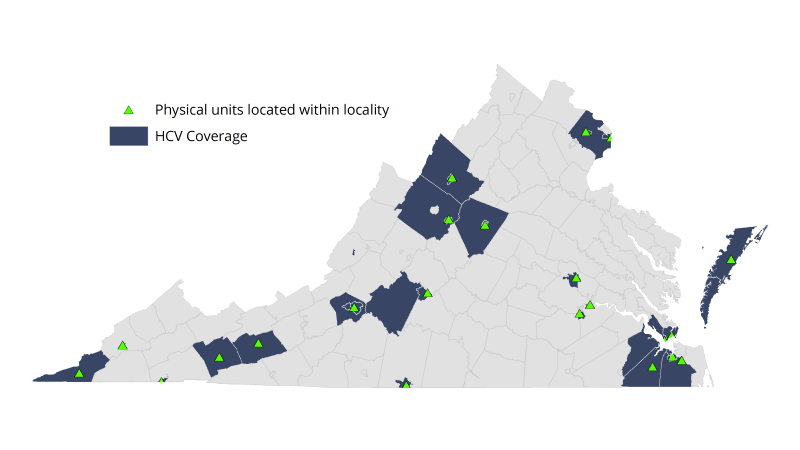

# Public housing authority survey {#part-2-phasurvey}

:::{.open data-latex=""}
This chapter summarizes the public housing authority survey that HousingForward Virginia circulated among public housing authorities across the Commonwealth to collect information on the demand for housing assistance in their communities.
:::

## Methods

From February to March 2021, HousingForward Virginia distributed an online survey to public housing authorities (PHAs) to understand the scope of their affordable housing portfolios and allocation of federal Housing Choice Vouchers. HousingForward Virginia, with assistance from the Virginia Association of Housing and Community Development Officials (VAHCDO), received feedback from 22 out of 33 HUD Direct Voucher Administrators.

The survey results illuminate the shortage of rental units and assistance to low-income households despite existing resources. Both PHAs and rental assistance programs often allow waiting lists, but if all existing PHA units were available to be leased, there still would be a deficit of 7,415 units to meet the waiting lists.

The PHA survey did not account for Project-based Vouchers and Rental Assistance Demonstration (RAD) units, which provide additional affordable units; administrators noted that there are waiting lists for these types of assistance as well. 

One administrator observed that the current private housing market is not just making it extremely difficult for voucher holders to locate and lease units, it is also raising per unit costs. Another PHA administrator explained that  they operate just over 260 conventional apartments with rents capped at 80 percent AMI without any subsidy in an attempt to provide “maximum stock” for the area’s low-income households.

(\#fig:pha-01)Geographic coverage of PHAs surveyed

## Waiting lists for PHA housing assistance programs

*All waiting lists are current as of March 2021.*

:::{.data data-latex=""}
Virginia has a deficit of **40,718 units** and **32,498 rental assistance vouchers** across 32 localities.
:::

### Public housing units

A majority of PHAs (82 percent) had open public housing waiting lists in early 2021. Two out of 22 authorities did not own and manage public housing units.

* Total units owned and managed: 12,536^[1,060 units are public housing units that have been converted to RAD.]
* Waiting list: 16,720^[Less than 200 waiting list households are for RAD.]

### LIHTC units

Half of authorities (50 percent) had open LIHTC waiting lists in early 2021. Thirty-six percent of authorities had no LIHTC units.

* Total units owned and managed: 4,047
* Waiting list: 7,278

### Housing Choice Vouchers

A majority of authorities (64 percent) had open HCV waiting lists in early 2021. Thirty-six percent of authorities expected to open waiting lists in 2022 and beyond.

* Total HCVs allocated: 30,731
* Total HCVs in use: 27,781
* Waiting list: 32,498
