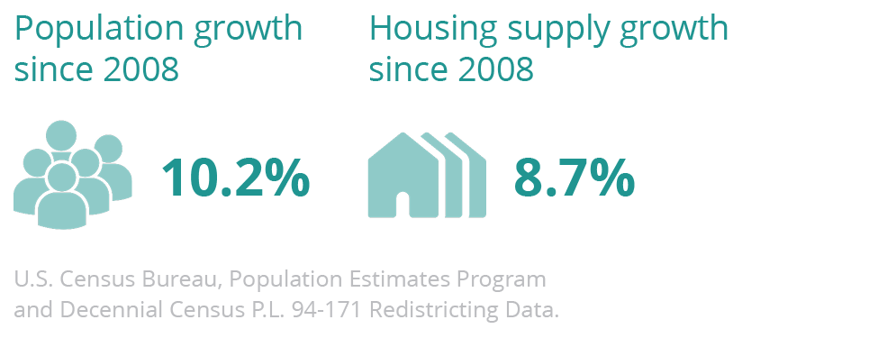

# Executive summary {.unnumbered}

::: {.open}
House Bill 854 (HB854) directed Virginia Housing and the Department of Housing and Community Development (DHCD) to complete a statewide study on affordable housing. Pursuant to that requirement, this report is the product of extensive research and engagement to understand Virginia’s current affordable housing landscape and to chart a path forward that recognizes the importance of affordable housing to all Virginians.
:::

<br>

:::{.info}
Click here for a high-resolution version of the executive summary that is suitable for print:
[HB854 Executive Summary](pdf/hb854-executive-summary.pdf) (PDF, 2.0 MB)
:::

### Background {.unnumbered}

Virginia Housing and DHCD are joint authors for this report. These agencies also received support from an external Stakeholder Advisory Group and the nonprofit organization HousingForward Virginia (HFV).

Per the bill’s requirements, Virginia Housing and DHCD assembled a Stakeholder Advisory Group (SAG) of thirty-nine housing experts who represented a wide range of regions, industries, and demographics. Members shaped the report’s priorities, participated in subgroups on specific policy issues, and helped design recommendations.

To aid both agency staff and SAG members, HFV was engaged as a research partner. HFV is a nonprofit, nonpartisan research and education organization that regularly supports housing studies throughout the Commonwealth. HFV contributed by administering surveys, analyzing data, and researching best practices.

<div id="research-and-findings">
<h2>Research and findings</h2>

HB854 asked stakeholders to determine the current and future housing needs of Virginians, including the availability of affordable housing across the state. Data from federal, state, and other sources were compiled, analyzed, and translated into major findings for the following topics.

<div id="demographic-trends">
<h3 style="color:#011E41;">Demographic trends</h3>

The demographics of Virginia will continue to evolve, but persistent disparities between generations and racial and ethnic groups require continued efforts to ensure opportunity for all.

::: {.execsum-1}
Virginia’s population growth over the past decade has concentrated along the Urban Crescent, which includes Northern Virginia, Richmond, and Hampton Roads. These areas are consistently increasing in diversity.
:::

```{r, execsum-01, out.width="80%", fig.align="center"}

```

::: {.execsum-1}
A dramatic rise in the older adult population will call for new senior housing opportunities across all parts of the Commonwealth.
:::

```{r, execsum-02, out.width="80%", fig.align="center"}

```

::: {.execsum-1}
Virginians born in this new century are much more racially and ethnically diverse than previous generations.
:::

```{r, execsum-03, out.width="80%", fig.align="center"}

```

::: {.execsum-1}
Housing options in Virginia should adapt to shrinking household sizes among both owners and renters in nearly every part of the state.
:::

```{r, execsum-04, out.width="80%", fig.align="center"}

```

</div>

<div id="economic-trends">
<h3 style="color:#011E41;">Economic trends</h3>

Despite strong growth in the face of two major recessions, new economic opportunities in Virginia are not equally distributed.

::: {.execsum-1}
Jobs rebounded quickly in metropolitan areas following the Great Recession and COVID-19 pandemic, but total employment levels in rural Virginia have consistently declined since 2008.
:::

```{r, execsum-05, out.width="80%", fig.align="center"}
knitr::include_graphics("img/execsum-05.png")
```

::: {.execsum-1}
Black and brown Virginians suffered a much higher rate of pandemic-related job losses compared to white Virginians and also consistently have lower average household incomes.
:::

```{r, execsum-06, out.width="80%", fig.align="center"}

```

::: {.execsum-1}
Many of the state’s fastest-growing job sectors, such as healthcare support occupations, offer below-average wages. These workers will have less income available for rent or mortgage.
:::

```{r, execsum-07, out.width="80%", fig.align="center"}

```

</div>

<div id="housing-inventory-and-production">
<h3 style="color:#011E41;">Housing inventory and production</h3>

Housing production has yet to recover to pre-Recession levels, while population and job growth continues.

::: {.execsum-1}
About 30,000 new homes are built in Virginia each year.

However, this rate is about half the annual production from the mid-2000s.
:::

```{r, execsum-08, out.width="80%", fig.align="center"}
knitr::include_graphics("img/execsum-08.png")
```

::: {.execsum-1}
Statewide population growth remains several percentage points above the increase in housing supply, even as shrinking average household sizes require more homes per person.
:::

```{r, execsum-09, out.width="80%", fig.align="center"}

```

::: {.execsum-1}
Even in the Urban Crescent, Virginia’s housing supply is predominantly detached single-family homes. These are also the most common new homes built, along with larger apartment buildings. 

Townhomes and small-scale apartments—which can be more affordable by design—remain relatively rare.
:::

```{r, execsum-10, out.width="80%", fig.align="center"}

```

</div>

<div id="homeownership-market">
<h3 style="color:#011E41;">Homeownership market</h3>

Virginia’s homeownership rate is consistently higher than the national average, but recent declines may continue without a proactive response to changing demographics and market conditions.

::: {.execsum-1}
Compared to the average Virginian, homeowners in the Commonwealth are older, more affluent, and more white.
:::

```{r, execsum-11, out.width="80%", fig.align="center"}
knitr::include_graphics("img/execsum-11.png")
```

::: {.execsum-1}
Homeownership among young adults is declining, while in many small and rural markets, a majority of homeowners are more than 55 years old.
:::

```{r, execsum-12, out.width="80%", fig.align="center"}
knitr::include_graphics("img/execsum-12.png")
```

::: {.execsum-1}
As of August 2021, the average single-family home in Virginia sold for $355,000—an increase over 30 percent from five years prior.
:::

```{r, execsum-13, out.width="80%", fig.align="center"}
knitr::include_graphics("img/execsum-13.png")
```

::: {.execsum-1}
Limited supply—especially of smaller homes equally sought after by young buyers and downsizing baby boomers—has lifted prices and kept homeownership out of the reach of many.
:::

```{r, execsum-14, out.width="80%", fig.align="center"}

```

</div>

<div id="rental-market">
<h3 style="color:#011E41;">Rental market</h3>

Many low-income renters continue to be cost-burdened as the deficit of affordable rentals grows and demand is ever-increasing.

::: {.execsum-1}
Four in five renters below 50 percent of their Area Median Income are cost-burdened. This is more than a quarter of a million households in Virginia—and that number continues to rise.
:::

```{r, execsum-15, out.width="80%", fig.align="center"}
knitr::include_graphics("img/execsum-15.png")
```

::: {.execsum-1}
Over half of Virginia’s approximately 170,000 publicly-supported rental apartments rely on Low-Income Housing Tax Credits from Virginia Housing. 
Without intervention, three-quarters of these could be lost to expiring affordability restrictions by 2040.
:::

```{r, execsum-16, out.width="80%", fig.align="center"}

```

::: {.execsum-1}
The current supply of federal Housing Choice Vouchers is inadequate to meet the need. For every household with a voucher, another seven are eligible but do not have one. Tens of thousands of low-income Virginians remain on waiting lists.
:::

```{r, execsum-17, out.width="80%", fig.align="center"}
knitr::include_graphics("img/execsum-17.png")
```

</div>

<div id="housing-instability-and-homelessness">
<h3 style="color:#011E41;">Housing instability and homelessness</h3>

COVID-19 could undo Virginia’s progress in reducing homelessness and stably housing tens of thousands of Virginians.

::: {.execsum-1}
Point-in-Time counts across Virginia have shown a general decline in observed homelessness—fewer than 6,000 individuals in 2020—although this was a slight uptick from 2019.
:::

```{r, execsum-18, out.width="80%", fig.align="center"}
knitr::include_graphics("img/execsum-18.png")
```

::: {.execsum-1}
On the other hand, housing instability among Virginia’s school-age children has increased in the past decade.
:::

```{r, execsum-19, out.width="80%", fig.align="center"}

```

::: {.execsum-1}
COVID-19 has put thousands of low-income Virginians behind on rent payments, which in turn put landlords at risk of missing their mortgage payments. 

Virginia’s national best practice for delivering rental assistance to both parties offers policy solutions to ensure long-term housing stability.
:::

```{r, execsum-20, out.width="80%", fig.align="center"}

```

::: {.execsum-1}
Homeowners in Virginia have fared better since the Great Recession and even during the pandemic, due in part to the federal foreclosure moratorium from March 2020  to July 2021.
:::

```{r, execsum-21, out.width="80%", fig.align="center"}

```

</div>

<div id="projections">
<h3 style="color:#011E41;">Projections</h3>

Many low-income renters continue to be cost-burdened as the deficit of affordable rentals grows and demand is ever-increasing.

::: {.execsum-1}
Virginia will likely reach a population of 10 million by 2040—with growth continuing to be concentrated in the Urban Crescent.
:::

```{r, execsum-22, out.width="80%", fig.align="center"}
knitr::include_graphics("img/execsum-22.png")
```

::: {.execsum-1}
The share of seniors in Virginia will grow faster than all other age groups, creating major shifts in housing demand, healthcare needs, and the workforce.
:::

```{r, execsum-23, out.width="80%", fig.align="center"}

```

<br>

::: {.caution}
Beyond these clearly significant forecasts, policymakers should use caution with population projections current as of this report.

Findings should be reevaluated when the latest 2020 Census figures are incorporated into new population predictions published by the University of Virginia Weldon Cooper Center for Public Service in 2022.
:::

</div>

</div>

<div id="effectiveness-of-current-programs">
<h2 style="color:#8B85CA;">Effectiveness of current programs</h2>

Per HB854 requirements, stakeholders reviewed the wide array of affordable housing programs currently offered by state agencies. More than thirty different programs—organized into six categories—were analyzed to determine their successes, challenges, and opportunities for improvement.

<p style="color:#8B85CA;">**OVERVIEW**</p>

Results from an assessment of practitioners indicate Virginia’s current housing efforts generally work well and should be continually strengthened and enhanced to fully meet needs across the state.

Over nearly 12 months, the SAG received feedback from hundreds of housing stakeholders across the state through surveys, focus groups, large and small “issue area” meetings, and one-on-one dialogues.

This engagement showed that Virginia’s two housing agencies are widely respected by housing providers, Virginians being served by program, administrators, developers, investors, real estate agents, lenders, and a range of other participants in Virginia’s affordable housing ecosystem.

These two agencies—their staff, policies, programs, and processes—were consistently credited for the substantial achievements and progress that the state has made in addressing affordable housing needs. Indeed, both organizations rise to the top when compared with their sister agencies in other states.

The recommendations in this report, which flow from these stakeholders, should be viewed in that context. In fact, one of the many virtues cited by providers was the openness of these agencies to hearing feedback and their commitment to constant improvement. The confidence that stakeholders have in Virginia Housing and DHCD fueled many of the suggestions that are offered.

<div id="affordable-rental-housing-production-programs">
<h3 style="color:#8B85CA;">Affordable rental housing production programs</h3>

Virginia’s affordable rental housing production efforts have been key to housing thousands of low-income Virginians.

* Virginia Housing’s Low-Income Housing Tax Credit program, working in conjunction with gap financing options like those provided by the Virginia Housing Trust Fund, produces nearly all new affordable rental housing in every corner of the state. However, the needs of cost-burdened renters continue to outpace production.
* Market conditions and local land use consistently put constraints on the availability and timing of new supply.

::: {.execsum-2}
Recommended strategies include increasing the Virginia Housing Trust Fund and similar resources, expanding program flexibility to maximize investments, and exploring a pilot program for additional supportive housing units in new affordable rental developments.
:::

</div>

<div id="rental-assistance-and-eviction-prevention-programs">
<h3 style="color:#8B85CA;">Rental assistance and eviction prevention programs</h3>

Virginia has made major strides to get assistance to low-income renters and unstably housed persons, in addition to addressing the eviction crisis.

* As of September 2021, the Virginia Rent Relief Program has helped more than 70,900 low-income households stay housed during the COVID-19 pandemic. The Commonwealth’s efficiency in deploying these federal funds is a nationally-recognized best practice for helping tenants and landlords.
* The State Rental Assistance Program (SRAP) operated by the Department of Behavioral Health and Developmental Services (DBHDS) has consistently outmatched its own goals for providing housing assistance to renters with developmental disabilities so they can live in integrated housing within their communities.

::: {.execsum-2}
Recommended strategies include project-basing a share of Housing Choice Vouchers administered by Virginia Housing, continuing to scale up SRAP, and reducing eligibility barriers for assistance programs per national best practices.
:::

</div>

<div id="homeownership-and-counseling-programs">
<h3 style="color:#8B85CA;">Homeownership and counseling programs</h3>

Homeownership programs in Virginia have successfully focused on the demand-side by helping low- and moderate-income households achieve homeownership. However, the lack of inventory remains the biggest impediment to homeownership opportunities for Virginians.

* Virginia Housing continues to assist and increase the number of first-time homebuyers taking advantage of their programs, particularly buyers of color. However, the scale of this progress alone is not enough to close the Black-white homeownership gap.
* Tight market conditions and increasing construction costs are driving up prices, preventing prospective buyers with limited savings from competing. This reduces the overall effectiveness of assistance programs.

::: {.execsum-2}
Recommended strategies include developing a statewide “starter home” initiative, increasing homeownership funding in existing competitive affordable housing programs, expanding outreach to Black institutions and networks, and increasing the involvement of for-profit developers.
:::

</div>

<div id="rehabilitation-and-accessibility-programs">
<h3 style="color:#8B85CA;">Rehabilitation and accessibility programs</h3>

A wide range of programs help Virginians improve the quality of their homes. Streamlining and expanding these efforts would make safe, efficient, and accessible housing a reality for thousands more.

* Rehabilitation and accessibility programs are generally effective thanks to their range and compatibility.
* However, these efforts often require providers to leverage other private funds, such as philanthropic gifts and individual donations, to effectively meet their community’s needs.

::: {.execsum-2}
Recommended strategies include expanding the Neighborhood Assistance Program, increasing program resources, streamlining administration, and addressing downstream issues like workforce and contractor capacity.
:::

</div>

<div id="community-revitalization-and-capacity-building-programs">
<h3 style="color:#8B85CA;">Community revitalization and capacity building programs</h3>

Virginia Housing and DHCD invest in local capacity to drive local solutions that create new housing opportunities.

* Using both federal and state dollars, a suite of community revitalization and capacity building programs foster creative approaches to meet the unique housing needs of Virginia’s diverse communities.
* Capacity building programs, especially those offered by Virginia Housing, strengthen affordable housing providers and make them resilient to future challenges.
* Opportunities for improvement are primarily administrative: these include better alignment of applications and project timelines, technical assistance, and streamlining the closing process.

::: {.execsum-2}
Recommendations include expanding the successful Vibrant Community Initiative, aligning state revitalization efforts with local public housing revitalization goals, encouraging more inclusive land use strategies, and facilitating greater involvement of developers and contractors who are Black and brown.
:::

</div>

<div id="homelessness-assistance-and-prevention-programs">
<h3 style="color:#8B85CA;">Homelessness assistance and prevention programs</h3>

Historic investments to reduce homelessness are making significant headways. Sustaining these efforts—and pivoting to more permanent solutions—could help overcome persistent challenges.

* Stable and increasing investments in the Virginia Homelessness Solutions Program and Homeless Reduction Grant, which are supported with both federal and state funding, have yielded clearly measurable successes. Point-in-Time counts of those experiencing homelessness have steadily declined over the past decade, although ongoing impacts of the COVID-19 pandemic could change this trajectory.
* The supply of housing available for persons transitioning out of homelessness is inadequate and is now a programmatic priority. Community resistance, financing limitations, and land use restrictions serve as barriers to ending homelessness.

::: {.execsum-2}
Recommended strategies include increasing the supply of deeply affordable housing, expanding long-term rental assistance options, increasing inter-agency collaboration, and better integrating housing services in criminal processing and educational systems.

These options would build upon the existing inter-agency, inter-secretariat collaborative efforts of the Governor’s Coordinating Council on Homelessness and Housing for Vulnerable Populations.
:::

</div>

</div>

<div id="hb854-policy-focus-areas">
<h2 style="color:#B1005F;">HB854 policy focus areas</h2>

HB854 specified four housing policy areas for stakeholders to generate new solutions:

1. A state-funded rental assistance program,
2. Utility rate reduction,
3. Property tax reduction, and
4. Bond financing options.

Stakeholders, along with both state housing agencies, unanimously agreed to add **racial equity** as a fifth focus area for significant recommendations.

These new housing initiatives may be needed to guarantee long-lasting affordability and address racial equity in the Commonwealth’s housing market.


<div id="state-funded-rental-assistance">
<h3 style="color:#B1005F;">State-funded rental assistance</h3>

A new state-funded rental assistance program could build on proven strategies to reduce housing instability and increase opportunities for low-income households.

* Over 300,000 low-income renters in Virginia are cost-burdened—a challenge faced disproportionately by Black, brown, and senior households.
* Current federal rental assistance and the supply of affordable rentals in Virginia do not satisfy the need thousands of low-income individuals and families have for housing assistance.

::: {.execsum-3}
Stakeholders recommend a statewide rental assistance program that prioritizes Virginians below 50 percent of Area Median Income and those experiencing housing instability, reduces barriers experienced in federal assistance programs, focuses on equity and efficiency, and ensures resident success through choice, mobility counseling, and landlord involvement.
:::

</div>

<div id="utility-rate-reduction">
<h3 style="color:#B1005F;">Utility rate reduction</h3>

Rising utility costs are contributing to housing unaffordability across Virginia. Addressing those costs may help ease the burden.

* Electricity, gas, water, and other essential utility costs strain the budgets of low-income Virginians—as well as those of affordable housing providers working to build and preserve units across the state.
* COVID-19 demonstrated that reliable high-speed internet access is critical for work, education, and healthcare for families. However, more than one-in-three households earning less than $20,000 do not have internet access in Virginia.

::: {.execsum-3}
Although state law and regulatory precedent disallow rate reduction carve outs for affordable housing, Virginia could address these challenges by unifying current and new efforts supported by expanded state and federal funding, helping localities reduce up-front utility costs for affordable housing, bolstering current energy efficiency measures, and leveraging the Commonwealth’s substantial new broadband investments to increase internet access and affordability for residents in affordable housing.
:::

</div>

<div id="property-tax-reduction">
<h3 style="color:#B1005F;">Property tax reduction</h3>

Real estate taxes often challenge the viability of affordable housing efforts in Virginia. State lawmakers could consider a constitutional amendment and stronger guidance to local assessors as efforts to reduce such burdens.

* Property taxes on affordable housing generate needed revenue for localities, but they can often serve as a barrier to development and preservation.
* While current state code directs local assessors to account for rent restrictions in some types of affordable rental housing, providers must frequently appeal incorrect valuations. This often leads to wasted efforts and continuing burdens on projects. 

::: {.execsum-3}
Stakeholders endorse a new amendment to the state constitution that would enable—not require—local governments to use a wide range of alternative real estate tax relief structures for properties used for affordable housing and homelessness services. Potential solutions include full and partial exemptions, abatements, and Payment in Lieu of Tax (PILOT) programs.

To address assessment challenges, stakeholders recommend minor code changes, along with expanded outreach to local assessors, to reduce these difficulties.
:::

</div>

<div id="bond-financing-options">
<h3 style="color:#B1005F;">Bond financing options</h3>

Bond financing is a critical tool Virginia uses to support affordable housing. Expanding and improving its use could help affordable housing production and preservation.

* The majority of Virginia’s Private Activity Bond allocation is used to create both affordable rental and homeownership opportunities. The Governor’s Pool has increasingly been used to support multifamily rental housing bonds.
* Localities in Virginia rarely use their general obligation bonding capacity to support housing.

::: {.execsum-3}
Virginia Housing and DHCD could continue and expand their bond efforts by monitoring allocation trends, increasing “gap” funding resources, and supporting beneficial changes to federal law currently being considered by Congress.

Recommended strategies for increasing local bonds for housing may include sharing best practices, incentivizing bond issuance (and similar local housing investments) within current programs, and exploring state funds to match and leverage any new local housing bonds.
:::

</div>

<div id="addressing-racial-equity">
<h3 style="color:#B1005F;">Addressing racial equity</h3>

Inequity in housing outcomes persists across racial lines in Virginia. Embracing new and proven strategies can help address disparities in homeownership, rental affordability, and housing stability.

* While better than the national average, Virginia has a wide homeownership rate gap that leaves Black households 25 points behind white households. The discriminatory policies, actions, and attitudes which led to this disparity also mean Black Virginians have higher rates of cost burden, live in poorer-quality housing, more often experience homelessness, or are housing insecure.
* Racial inequity exists on both sides of the housing equation; ownership of production and development companies, along with nonprofit leadership, are predominantly white.
* Both Virginia Housing and DHCD have successfully expanded their initiatives to advance fair housing goals, including improving access to homeownership for Black Virginians.

::: {.execsum-3}
Continued efforts to address racial equity in housing will require Black and brown-led long-term engagement, as well as continued statewide leadership.

Recommended strategies to address these racial disparities in housing seek to expand Black access to homeownership, help mitigate the effects of gentrification, increase success and choice in rental assistance programs, and ensure that equity is considered at all levels of the housing industry.
:::

</div>

</div>