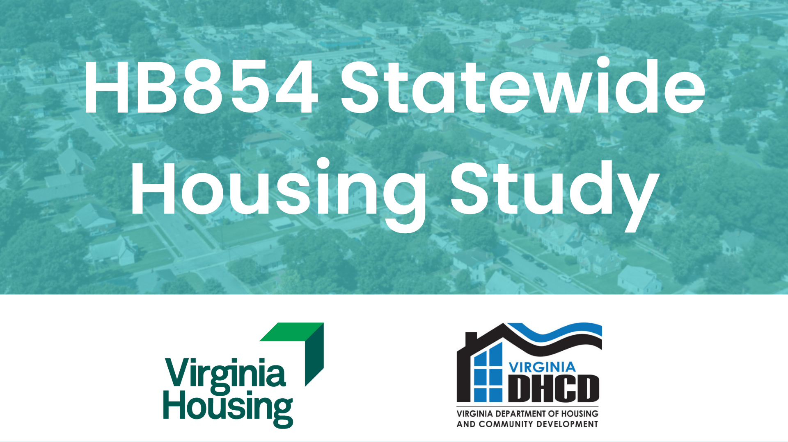

# About this report {.unnumbered}

```{r cover-img}

```

<br>

This is the online version of the **HB854 Statewide Housing Study**, a report commissioned by the Virginia General Assembly to investigate housing needs across the Commonwealth and makes recommendations to state housing agencies, the General Assembly, and Governor's Office for improving housing affordability and opportunity for all Virginians.

The final report was delivered to lawmakers in January 2022 and is available on the [Reports to the General Assembly Portal](https://rga.lis.virginia.gov/Published/2022/HD3) page of the Division of Legislative Automated Systems (DLAS) website.

<br>

:::{.info}
Click here for a full high-resolution version of this report that is suitable for print:
[HB854 Statewide Housing Study](pdf/hb854-full-report-print.pdf) (PDF, 18.3 MB)
:::

<br>

:::{.caution data-latex=""}
A desktop computer, laptop computer, or tablet are recommended for viewing this online version of the report. Mobile users may encounter trouble with some of the embedded interactive data dashboards.
:::