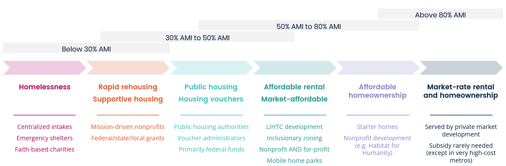

# Why affordability matters {#part-1-affordability}

::: {.open data-latex=""}
This chapter explains the basics of housing affordability, makes the case for addressing high housing costs to make our communities more successful, and demonstrates the basic mechanisms available for making housing more affordable across Virginia.
:::

## How do we define affordable housing?

Affordable housing is not a specific type of housing. Rather it is housing within the financial reach of Virginians across the full spectrum of incomes and budgets. But how do we measure what is affordable?
 
### Household cost burden
 
There are multiple ways of measuring housing affordability. One key metric is the U.S. Department of Housing and Urban Development’s (HUD) 30 percent rule. This is a simple ratio that states housing is affordable when an individual or family pays no more than 30 percent of their gross household income on regular housing costs, including rent or mortgage and basic utilities.

If someone is paying more than 30 percent of gross household income on housing costs, then the household is *cost-burdened.* If an owner or renter spends more than 50 percent of gross income on housing, the household is *severely cost-burdened.*

Cost-burdened households have less to spend on other necessities such as groceries, healthcare, and transportation. When expenses stretch budgets to the breaking point, families and individuals make sacrifices to stay in their home that risk their health and well-being.  
 
### Community affordability
 
Affordability is not limited to the expense of an individual home; it extends to the surrounding neighborhood and community. Communities that offer a range of housing options ensure that there are enough homes for all types of households, regardless of income or circumstance.

The most common way to measure the affordability of a community is to compare household incomes with the cost of homes to buy or rent. Housing disparities limit a community’s capacity to thrive; incomes must be adequate to offer residents a range of housing options without becoming cost-burdened. 

To better understand where needs and gaps exist in housing markets, researchers can define the ability of a household to pay for housing by comparing their income to a regional average. HUD determines this *Area Median Income* (AMI) each year for every community in the country using data from the U.S. Census Bureau.

:::{.info data-latex=""}
Official AMI limits for communities are published on the [HUD website](https://www.huduser.gov/portal/datasets/il.html). Current 2021 limits are effective until April 2022.
:::

Area median income is a useful way to conceptualize the full range of housing needs and solutions in a community. For example, in most areas, households earning 100 percent of AMI or above generally have fewer challenges finding and affording their homes.

Households with incomes at or slightly below 80 percent AMI (“low-income”) might have less cost burden, but have trouble saving enough to buy their first home.

Households with incomes near 50 percent AMI (“very low-income” or "VLI") are much more likely to rent and have challenges finding good-quality apartments with rents that match their budget.

Households with incomes below 30 percent AMI (“extremely low-income” or "ELI") have the most trouble securing stable, affordable homes.

Figure 1.1 shows these income ranges overlaid on some of the most common housing types and public programs used by households in those categories. This is commonly referred to as the *housing spectrum.*

```{r, housing-spectrum, fig.cap="The housing spectrum"}

```

Policymakers also use AMI to help direct housing assistance programs to households with the greatest needs. For example, most down-payment grants for first-time homebuyers are limited to households earning less than 80 percent AMI. Many rental assistance programs cap eligibility at 50 percent AMI or 60 percent AMI.

## Why is housing important?
 
Housing is foundational for households, communities, and economies.
 
**Affordable housing helps build wealth.**
 
Owning a home remains the most important way for Americans to build wealth. For nearly a century, homeownership has been the best pathway for households to achieve housing security, accumulate wealth, and pass wealth on to the next generation. Federal policy continues to endorse and promote homeownership via government-backed mortgages and the mortgage interest deduction.

As homeownership becomes increasingly difficult for many to achieve---especially in the wake of the 2008 housing crisis and Great Recession---affordable housing for all emerges as a core economic issue. Renters who are not cost-burdened have greater financial security and can save more of their income to plan for future expenses.

*Why housing is important for wealth-building:*
 
* Across the country, the average homeowner has 40 times the total household wealth of the average renter. [@bhutta2020]
* Research has shown that households paying affordable rents in Low-Income Housing Tax Credit (LIHTC) units were able to double their discretionary spending, allowing them to cover necessities like health insurance, pay down debt, or increase their savings. [@lisc2010]

**Better homes lead to better health.**
 
A safe and stable home is essential for a healthy life. When we are able to comfortably afford our homes, we are able to spend money on food, health care, and other resources that affect health outcomes. The security of an affordable quality home also alleviates the stress of precarious circumstances that burden residents’ physical and mental health.

The COVID-19 pandemic has centered attention on the role of housing in individual and public health. Without a safe home, many people cannot effectively quarantine. This increases the spread of communicable disease within a household and in the community.   

*Why housing is important for health:*
 
* Numerous studies have demonstrated a link between overcrowding and the spread of infectious diseases, like COVID-19. [@gray2021] When a home is too small for a family, they are in much closer contact and are unable to properly quarantine.
* Researchers at Brown University found that counties with a higher percentage of poor housing---particularly overcrowded and without plumbing---had a higher incidence of and mortality associated with COVID-19. [@ahmad2020]
* Substandard housing conditions---such as lead paint, overcrowding, and poor plumbing---are three times more likely to impact Black households than white, non-Hispanic households and reduce their health outcomes. [@matthew2016] [@boulware2020]
* According to the American Health Homes Survey, Black households are more likely to have lead-based paint hazards in their homes (45 percent) than their white counterparts (32 percent). [@ashley2011]

**Better housing options alleviate transportation challenges.**
 
Housing and transportation are inextricably linked because where we live often determines our mode and cost of travel to reach basic necessities, like grocery stores and medical care. Transportation is typically a household’s second largest expenditure after housing.

When housing is easily connected to conveniences like grocery stores, child care, or healthcare facilities, we are more likely to opt  to walk or use public transit reducing transportation expenses. Diverse housing like apartments, townhomes, duplexes, and manufactured home communities offer options that allow residents to choose a lifestyle that meets their needs and wants.
 
*Why housing is important for transportation:*
 
* Households in the Washington, DC Metropolitan Statistical Area (MSA) spend an average of $12,939 on transportation per year. The average share of total income these households spend on transportation and housing is 41 percent. [@cnt2021]
* Many modest-wage jobs are not efficiently located near lower-cost housing, according to a spatial analysis of employment and housing in the Richmond region by Virginia Commonwealth University. [@jacobson2017]
 
**A strong housing industry supports Virginia’s economy.**
 
Building more homes means more jobs. The housing industry provides thousands of jobs throughout Virginia. From real estate agents that sell homes, developers that buy and plan, builders that construct, lenders that help finance, and nonprofits that serve their clients, the housing industry supports a robust economy in Virginia.

More housing also means that Virginia can better accommodate its workforce. Affordable places to live that match available wages and salaries will attract talented people to Virginia’s employers and communities. 
 
*Why housing is important for our economy:*
 
* Virginia’s housing industry accounted for $28.1 billion in direct economic output in 2015 according to a report from the Governor’s Housing Policy Advisory Council. Housing is the sixth-largest private sector industry in the Commonwealth. [@vchedr2017]
* Housing supports more than 314,000 jobs across the state and helps pay more than $14 billion in total wages.

## How can we make housing more affordable?
 
Policymakers can help keep housing costs reasonable by *supporting new affordable housing* and by *making current housing more affordable.* Both approaches are necessary and complimentary.
 
**Supporting new affordable housing** increases the supply of homes available to buy or rent at prices that are within reach of moderate-income and low-income households. Both the public sector and private market help accomplish this. Governments can change regulations and provide funding to allow for-profit and nonprofit builders to create new affordable homes.
 
Examples of these supply-side solutions include:

* Local land use reforms to allow lower-cost housing types,
* Project-based rental assistance attached to specific apartments,
* Development subsidies, tax credits, and other incentives in exchange for creating below-market homes, and
* Alternative tenure models, such as community land trusts.

:::{.info data-latex=""} 
Virginia’s housing agencies help create new affordable homes with programs that address:

* Affordable rental housing production (see [Chapter 20](#part-4-rentalproduction)),
* Community revitalization and capacity building (see [Chapter 24](#part-4-revitalization)), and
* Homelessness assistance and prevention (see [Chapter 25](#part-4-homelessness)).

These initiatives build and preserve thousands of affordable homes each year.
:::
 
**Making current housing more affordable** is accomplished by providing a wide range of assistance packages to households who need help paying their rent, mortgage, or utility bills; who are looking to buy their first home; who are facing housing instability; or who need physical improvements to their homes.
 
Governments can help serve these households with a range of demand-side solutions, including:

* Tenant-based rental assistance (such as Housing Choice Vouchers),
* Homebuyer down payment grants and government-backed mortgages,
* Eviction prevention and diversion programs, and
* Investments in energy efficiency, weatherization, and accessibility improvements for current homeowners.
 
:::{.info data-latex=""}
Virginia’s housing agencies help lower housing costs for currency homeowners and renters with programs that address:

* Rental assistance and eviction prevention (see [Chapter 21](#part-4-rentalassistance)),
* Homeownership and counseling (see [Chapter 22](#part-4-homeownership)),
* Rehabilitation and accessibility (see [Chapter 23](#part-4-rehab)), and
* Homelessness assistance and prevention (see [Chapter 25](#part-4-homelessness)).

These efforts help tens of thousands of Virginians with their housing needs each year.
:::