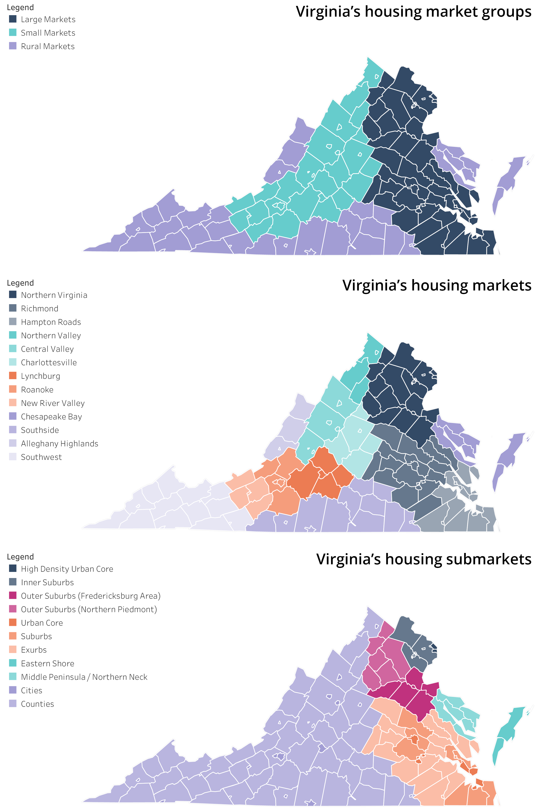
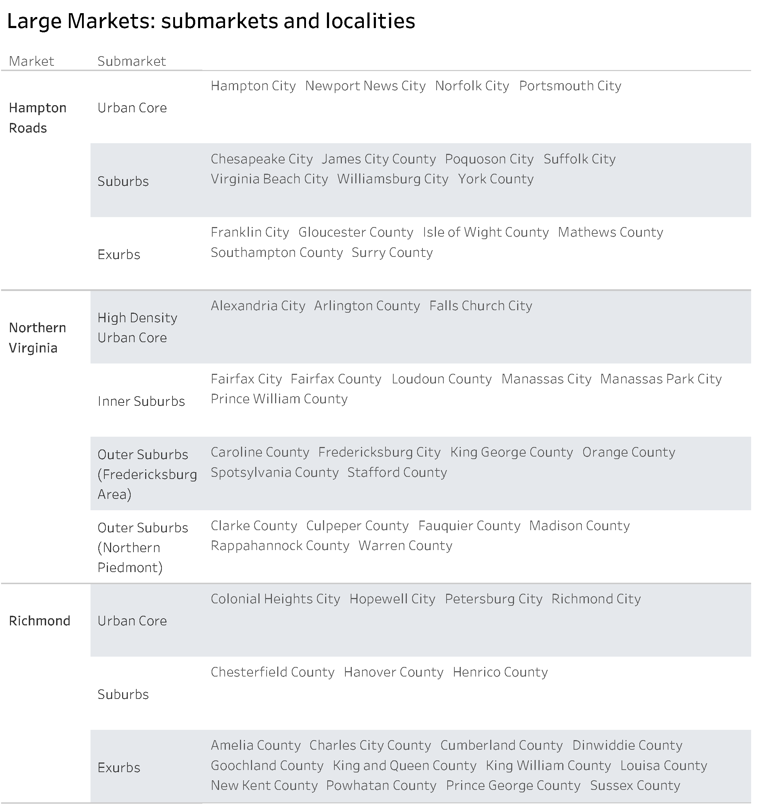
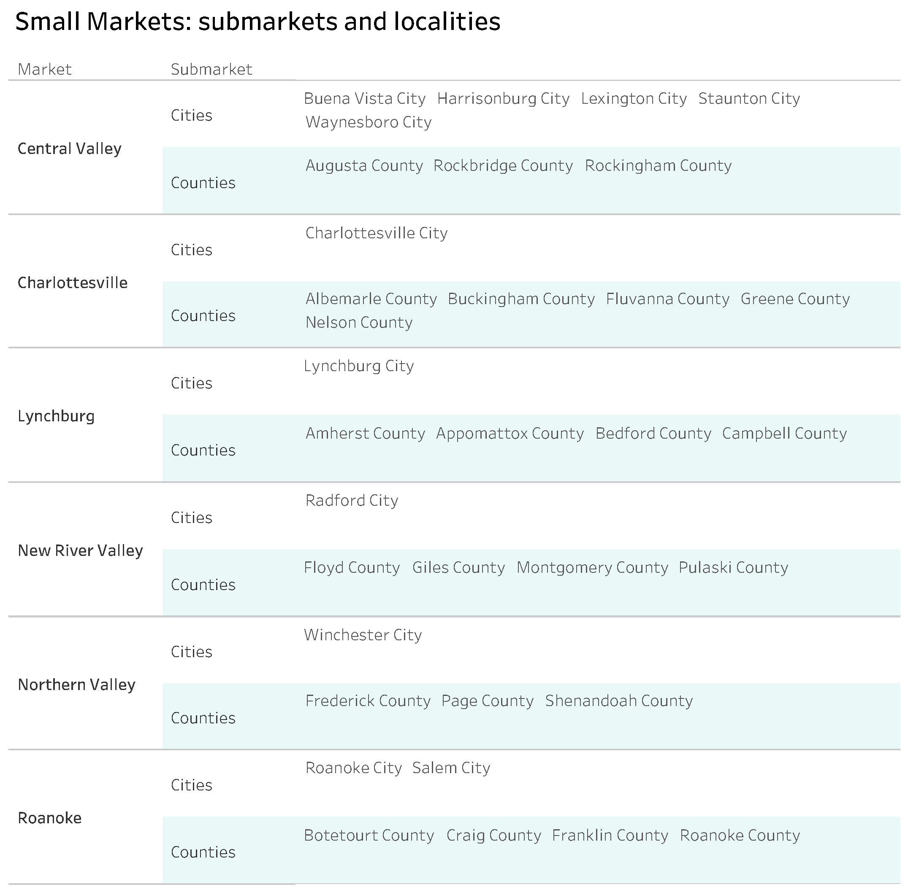
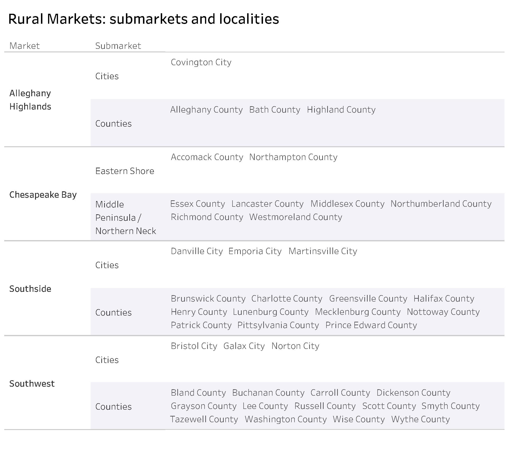

# Virginia’s housing markets {#part-1-markets}

:::{.open data-latex=""}
This chapter outlines the three levels of geographic regions across Virginia used to describe housing needs and trends in different parts of the Commonwealth. The Research and Findings part of this report ([Part 3](#part-3)) uses these market and submarket categories.
:::

To illustrate important housing trends throughout the Commonwealth, this report presents data according to three tiers of market groups aggregated by city/county and described below.

At the highest level, Virginia is divided into three major categories: Large Metro Housing Markets (the “urban crescent”), Small Metro Housing Markets^[These markets are sometimes referred to as the “reverse crescent” of Virginia. However, this is not a commonly used term and is therefore not applied in this report.], and Rural Housing Markets. This report will often abbreviate these markets to Large Markets, Small Markets, and Rural Markets.

Within each of these major categories are distinct housing markets that generally correspond with familiar metro regions; for example, Hampton Roads, Charlottesville, and Southwest.

Finally, each market is divided further into submarkets that reflect nuances within each market. For example, the Richmond market is divided into its urban core, suburbs, and exurbs, while the Chesapeake Bay is divided into the Northern Neck/Middle Peninsula and the Eastern Shore.

\newpage

```{r markets-01, fig.cap="Virginia's housing market groups, markets, and submarkets used in this report"}
if (knitr::is_html_output()) {
knitr::include_url(url = "https://public.tableau.com/views/HB854-VirginiasHousingMarkets/markets_db?:showVizHome=no&:embed=true", height = "400px")
} else {

}
```

\newpage

## Large Metro Housing Markets

Characteristics of these markets include:

* Moderate-high population density and population growth,
* High housing costs that are rising faster than incomes, contributing to high levels of cost burden,
* High land costs and shortage of land available for residential development,
* Economic and household growth pressures pushing residential development into lower density peripheral exurban localities,
* Large commuting range with significant transportation pressures related to household growth,
* Significant need for higher density and multifamily residential development, and
* Concentrated poverty and limited access to affordable housing in areas of opportunity.

\newpage

```{r markets-02, fig.cap="Large Markets: submarkets and localities"}
if (knitr::is_html_output()) {
knitr::include_url(url = "https://public.tableau.com/views/HB854-VirginiasHousingMarkets-LargeMarkets/list_lm_db?:showVizHome=no&:embed=true", height = "750px")
} else {

}
```

\newpage

## Small Metro Housing Markets

Characteristics of these markets include:

* Moderate-to-low population density and population growth,
* Moderate housing costs which are rising faster than incomes for low-to-moderate income households, and high cost burden among lower income groups,
* Higher homeownership rates than in Large Metro markets but limited new housing construction to accommodate first-time buyer needs,
* Rising land costs and shortage of land available for residential development,
* Residential development being pushed into lower density peripheral exurban localities, resulting in larger commuting ranges and increased transportation pressures,
* Aging population and limited affordable senior housing options, and
* Significant differential between owner and renter incomes leading to continued concentration of poverty and limited access to opportunity for low-income households, especially minority populations---though on a more limited scale than in Large Metro markets.

```{r markets-03, fig.cap="Small Markets: submarkets and localities"}
if (knitr::is_html_output()) {
knitr::include_url(url = "https://public.tableau.com/views/HB854-VirginiasHousingMarkets-SmallMarkets/list_sm_db?:showVizHome=no&:embed=true", height = "600px")
} else {

}
```

\newpage

## Rural Housing Markets

Characteristics of these markets include:

* Low density,
* Low growth or declining population,
* A rapidly aging population,
* Low household income and income insufficient to support new housing development, except for limited custom home development,
* Weak private-sector housing industry (finance/development/real estate) due to weaker economies, low income levels, and lack of adequate economies of scale,
* Higher reliance on manufactured housing than other markets,
* Aging and deteriorating housing inventory,
* Inadequate new housing production to support quality housing options (which is a major barrier to new economic development), and
* Limited affordable senior housing options.

```{r markets-04, fig.cap="Rural Markets: submarkets and localities"}
if (knitr::is_html_output()) {
knitr::include_url(url = "https://public.tableau.com/views/HB854-VirginiasHousingMarkets-RuralMarkets/list_rm_db?:showVizHome=no&:embed=true", height = "600px")
} else {

}
```
