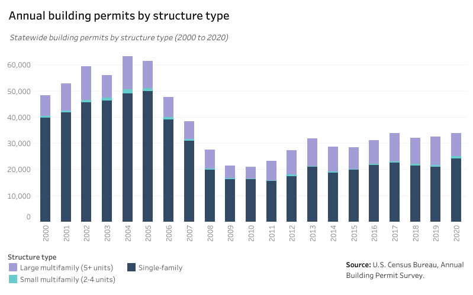
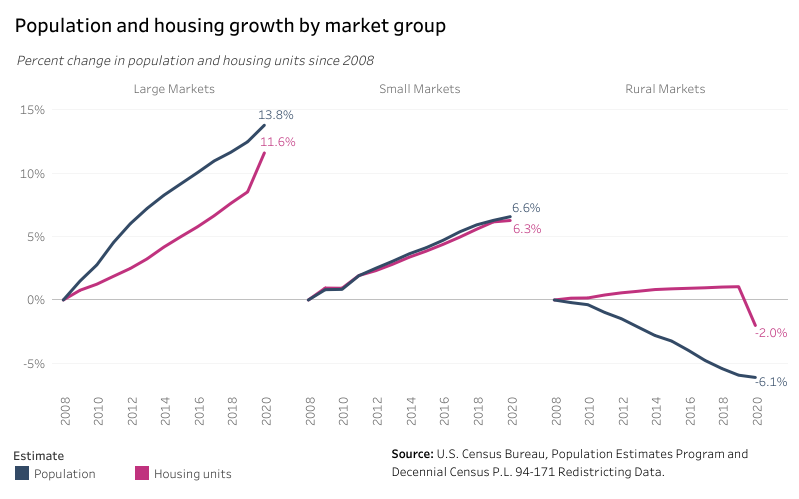

# Housing inventory and production {#part-3-inventory}

::: {.open data-latex=""}
This chapter evaluates high-level trends in Virginia’s housing stock. That includes overall production relative to population and job growth and the type, size, age, and quality of the places Virginians call home.
:::

## Highlights {.unlisted .unnumbered}

Major takeaways in this chapter include:

* Housing production has yet to recover to pre-Recession levels, while population and job growth continues.
* About 30,000 new homes are built in Virginia each year. However, this rate is about half the annual production from the mid-2000s.
* Statewide population growth remains several percentage points above the increase in housing supply, even as shrinking average household sizes require more homes per person. This gap is driven by Large Metro Housing Markets.
* Virginia’s housing supply is predominantly detached single-family homes, even throughout much of the urban crescent. These are also the most common new homes built, along with larger apartment buildings.
* Townhomes and small-scale apartments---which can be more affordable by design---are a very small fraction of the supply added in recent decades.
* On average, Virginia’s housing stock is aging. Older homes---with potential health and safety shortcomings---are more prevalent in cities and rural areas.
* Overcrowded homes---with more than one person per room---are rare, but are much more frequently occupied by low-income renters.

## Housing production

### Finding 1: More than 30,000 new homes are built in the state each year. {.unlisted .unnumbered}

#### However, that production is roughly half the number of annual housing starts in Virginia during the mid-2000s. {.unlisted .unnumbered}

```{r inv-01, fig.cap="Annual building permits by structure type"}
if (knitr::is_html_output()) {
knitr::include_url(url = "https://public.tableau.com/views/HB854-InventoryandProduction-Annualbuildingpermitsbystructuretype/type_db?:showVizHome=no&:embed=true", height = "500px")
} else {}
```

:::{.caution data-latex=""}
The Building Permits Survey data collected by the U.S. Census Bureau only disaggregates multifamily buildings into three types:
 
* Two-family buildings,
* Three- and four-family buildings, and
* Five-or-more family buildings.

This is different from the categorization of multifamily buildings used in other parts of this report. Note: When using Building Permit Survey data this report classifies small multifamily as 2-4 units and large multifamily as 5-or-more units.
:::

The average annual number of building permits for the last decade has stayed around 30,000, roughly equivalent to the number of homes currently in the City of Lynchburg. Those figures may seem large, but they are just above half of the annual permits filed across the state in the early 2000s. During that last building boom, Virginia was adding between 50,000 and 60,000 new homes per year---closer in size to today’s Spotsylvania County.

### Finding 2: Most new homes are built in suburbs throughout the urban crescent. {.unlisted .unnumbered}

#### In Small Metro and Rural Housing Markets, production is in counties---not cities. {.unlisted .unnumbered}

```{r inv-02, fig.cap="Cumulative building permits"}
if (knitr::is_html_output()) {
knitr::include_url(url = "https://public.tableau.com/views/HB854-InventoryandProduction-Cumulativebuildingpermits/type_sm_db?:showVizHome=no&:embed=true", height = "500px")
} else {}
```

The largest share of new homes built in the Commonwealth since 2000 are in suburban submarkets in the urban crescent, along with counties in Small and Rural Markets. Many of these are single-family homes built prior to 2008. For every home built in an Urban Core in a Large Market or in a small or rural city, *more than three* were built in metro suburbs.

### Finding 3: Virginia is adding people faster than homes. {.unlisted .unnumbered}

#### Since 2008, housing production continues to lag behind population growth. {.unlisted .unnumbered}

```{r inv-03, fig.cap="Population and housing growth in Virginia"}
if (knitr::is_html_output()) {
knitr::include_url(url = "https://public.tableau.com/views/HB854-InventoryandProduction-PopulationandhousinggrowthinVirginia/pop_hu_db?:showVizHome=no&:embed=true", height = "500px")
} else {}
```

Since the Great Recession, the Commonwealth’s population has grown more than ten percent, captured by a stronger-than-expected count in the 2020 Census. At the same time, the total housing supply across the state increased by just under nine percent. This underproduction—combined with general trends toward smaller household sizes—increases demand for existing homes.

### Finding 4: The population-housing gap is driven by Large Metro Housing Markets. {.unlisted .unnumbered}

#### Housing production in Small Metro and Rural Housing Markets is generally keeping pace with population growth. {.unlisted .unnumbered}

```{r inv-04, fig.cap="Population and housing growth by market growth"}
if (knitr::is_html_output()) {
knitr::include_url(url = "https://public.tableau.com/views/HB854-InventoryandProduction-Populationandhousinggrowthbymarketgroup/pop_hu_mg_db?:showVizHome=no&:embed=true", height = "500px")
} else {}
```

Housing underproduction relative to population growth is most significant in Virginia’s Large Markets as new construction remains well behind pre-2008 levels throughout the urban crescent.

In Small Markets, population and housing growth have mostly aligned at around six percent since 2008. In Rural Markets---where population is declining---housing production remained commensurately low but still slightly positive until 2020. The recent 2020 Census count showed an unexpectedly low two percent decline in housing units in rural Virginia since 2008.

### Finding 5: Prior to COVID-19, Virginia was adding many more jobs than homes. {.unlisted .unnumbered}

#### Between 2009 and 2019, job growth outpaced the number of new individual housing units added across the state. {.unlisted .unnumbered}

```{r inv-05, fig.cap="Job-housing imbalance"}
if (knitr::is_html_output()) {
knitr::include_url(url = "https://public.tableau.com/views/HB854-InventoryandProduction-InventoryandJobs/Dashboard1?:showVizHome=no&:embed=true", height = "500px")
} else {}
```

Economic growth---and the jobs that follow---are a major component of housing demand. Virginia’s economy recovered relatively well from the 2008-2010 Great Recession, adding over 12 percent additional jobs by 2019. Over that same period, the number of individual housing units available to become home to workers, their families, and all other Virginians increased by just under six and a half percent.

The job losses resulting from the pandemic’s economic crisis inverted the annual ratio of employment to housing unit estimate for 2020, but many of those jobs subsequently returned and have been filled as of summer 2021.

## Structure type

### Finding 1: Most Virginians live in single-family homes. {.unlisted .unnumbered}

#### Multifamily apartments account for fewer than one in four homes. {.unlisted .unnumbered}

```{r inv-06, fig.cap="Housing type by tenure"}
if (knitr::is_html_output()) {
knitr::include_url(url = "https://public.tableau.com/views/HB854-InventoryandProduction-Housingtypeandtenure/type_tenure?:showVizHome=no&:embed=true", height = "500px")
} else {}
```

Virginia is predominantly a single-family home state. Almost three in four of all households---including 40 percent of renters—live in detached or attached single-family homes. Though attached townhomes may be common in some more dense areas, they are still outnumbered five times by detached single-family homes statewide. Most Virginians do not share walls with their neighbors.

:::{.info data-latex=""}
This arrangement is not by chance. In the early 20th century, localities in Virginia (and across the nation) began adopting zoning ordinances that regulated land uses. While many of these new restrictions attempted to promote public health and welfare by separating noxious activities from residential areas, they were just as commonly used to segregate communities by race and class via single-family only zoning. The history of this activity in Virginia---and its continued legacy---were the subject of a recent paper by the McGuireWoods Zoning and Segregation Work Group, which can be read in full [here](https://media.mcguirewoods.com/publications/2021/Zoning-And-Segregation-In-Virginia-Study-Part1.pdf).

The prevalence of single-family zoning over the past century has also contributed to car-oriented suburban sprawl. When localities limit the diversity of housing options available to build (including smaller homes, townhomes, and multifamily buildings), more land per home is needed. As a result, nearly all communities built-out in Virginia after the Second World War are difficult to navigate by anything other than a personal vehicle. Traveling by foot to an adjacent neighborhood, or the grocery store, is nearly impossible on foot. These auto-dependent areas contribute to longer commutes, more congestion and pollution, and greater transportation spending.
:::

Multifamily homes are much more likely to be leased rather than owned as condominium units; just five percent of all owners live in either a small or large multifamily building. Nearly half of renters (46 percent) live in large apartment buildings with five or more units.

A small but similarly-sized share of owners (five percent) and renters (four percent) live in manufactured homes throughout the state.

### Finding 2: Single-family and larger multifamily buildings make up nearly all new homes in Virginia. {.unlisted .unnumbered}

#### Small-scale apartments are rarely built. {.unlisted .unnumbered}

```{r inv-07, fig.cap="Cumulative building permits by structure type"}
if (knitr::is_html_output()) {
knitr::include_url(url = "https://public.tableau.com/views/HB854-InventoryandProduction-Cumulativebuildingpermitsbystructuretype/type_cum_db?:showVizHome=no&:embed=true", height = "500px")
} else {knitr::include_graphics("img/inv-07.png")}
```

Home builders in Virginia continue to build what is already most familiar: single-family homes and large apartment buildings. Since 2000, the rate of single-family production has more than tripled that of multifamily production. However, while the pace of multifamily construction has remained steady over the past two decades, single-family output has slowed relative to pre-recession levels.

Over the same past 20 years, developers and builders produced fewer than 14,000 units of small multifamily homes (2-4 units per building) across the state—less than two percent of all new homes built. These buildings, which make up a significant portion of rental homes available in older cities across Virginia, are often considered the [“missing middle”](https://missingmiddlehousing.com/) homes along with other small-scale apartment complexes.

### Finding 3: Single-family homes are the most common housing type built across the state. {.unlisted .unnumbered}

#### Only in Small Metro Housing Markets are multifamily homes becoming more common. {.unlisted .unnumbered}

```{r inv-08, fig.cap="Share of building permits by structure type"}
if (knitr::is_html_output()) {
knitr::include_url(url = "https://public.tableau.com/views/HB854-InventoryandProduction-Shareofbuildingpermitsbystructuretype/type_mg_pct_db?:showVizHome=no&:embed=true", height = "500px")
} else {}
```

Single-family production outpaces multifamily starts even in Large Markets. Throughout the urban crescent, nearly four in five homes built before 2008 were single-family. That share was higher in Small and Rural Markets.

Three important trends emerged after the Great Recession. First, the multifamily share of production in Large Markets expanded to nearly 40 percent (although that trend later ended according to 2020 permit data). Second, the multifamily share of production in Small Markets has grown from around 20 percent to almost 40 percent. Third, the already small share of apartment construction in Rural Markets has declined to a negligible amount.

### Finding 4: Small Metro Housing Markets are playing catch-up to meet new demand for apartments. {.unlisted .unnumbered}

#### Multifamily production in Large Metro Housing Markets has remained relatively consistent since 2000. {.unlisted .unnumbered}

```{r inv-09, fig.cap="Multifamily share of all building permits"}
if (knitr::is_html_output()) {
knitr::include_url(url = "https://public.tableau.com/views/HB854-InventoryandProduction-Multifamilyshareofallbuildingpermits/mf_mn_pct_db?:showVizHome=no&:embed=true", height = "500px")
} else {}
```

The increase in new multifamily buildings is most visibly dramatic in Northern Virginia, Richmond, and Hampton Roads. While those three Large Markets are certainly home to the highest net counts of new apartments, as of 2020 they are behind four of Virginia’s six Small Markets in terms of *the share* of new homes that are multifamily.

Notably, new apartment construction is relatively strongest in the Blacksburg-Christiansburg, Roanoke, and Lynchburg areas, especially since 2010. In 2020, more than three-quarters of all new homes built in the Blacksburg-Christiansburg market were multifamily, likely the result of demand from students at Virginia Tech and Radford University. In Charlottesville---another Small Market anchored by a university---apartments account for well over a third of all new homes built since 2010.

Throughout the urban crescent, apartment construction is more prevalent in core cities, but overall fewer than one in three new homes are apartments. Single-family homes still dominate housing starts in these areas.

### Finding 5: About 2,000 new manufactured homes are added in the state each year. {.unlisted .unnumbered}

#### Those deliveries are a fraction of 1990s levels. {.unlisted .unnumbered}

```{r inv-10, fig.cap="Manufactured and modular home deliveries"}
if (knitr::is_html_output()) {
knitr::include_url(url = "https://public.tableau.com/views/HB854-InventoryandProduction-Manufacturedhomedeliveries/Dashboard1?:showVizHome=no&:embed=true", height = "500px")
} else {}
```

Factory-built homes may be relatively uncommon statewide, but they are an affordable solution for thousands of Virginians, especially in rural communities across Southside and Southwest. Throughout the 1990s, Virginia added about 6,000 new manufactured homes per year delivered from factories both inside and outside the state. Beginning in the 2000s, those deliveries began declining as site-built housing became more abundant and affordable. Since then, total annual deliveries have remained near or below 2,000.

While most manufactured homes built between mid-century and the 1990s were single-section, larger multi-section homes became increasingly common by the 2000s when they accounted for well over half of new deliveries.

:::{.data data-latex=""}
As of 2013, Virginia Manufactured and Modular Housing Association (VAMMHA) also began estimating modular home deliveries. These units are composed of multiple factory-built sections that are assembled on site and conform to [state building code](https://dhcd.virginia.gov/virginia-uniform-statewide-building-code-usbc) rather than [HUD manufactured home regulations](https://www.ecfr.gov/current/title-24/subtitle-B/chapter-XX/part-3280). Several hundred have shipped out across the state annually in recent years.
:::

## Age and quality

### Finding 1: The average home in Virginia is about 40 years old. {.unlisted .unnumbered}

#### Renters have slightly older homes than homeowners. {.unlisted .unnumbered}

```{r inv-11, fig.cap="Age of housing stock"}
if (knitr::is_html_output()) {
knitr::include_url(url = "https://public.tableau.com/views/HB854-InventoryandProduction-Ageofhousingstock/yb_ten_db?:showVizHome=no&:embed=true", height = "500px")
} else {}
```

Most Virginians live in homes built between 1970 and 2009. Housing production across those four decades was fairly consistent and significantly more plentiful than during any other time period. Still, there currently are many more occupied homes built prior to 1970 than homes built after 2009. The average Virginian---who is about 38 years old---is probably living in a home built around the same time they were born.

There are small but noticeable differences between the age of homes occupied by owners and renters. This is mostly the result of higher single-family home production in the 1990s and 2000s and the growth in homeownership that followed.

### Finding 2: Older homes are more common in cities while newer homes are in the suburbs. {.unlisted .unnumbered}

#### The Eastern Shore and rural counties also have older-than-average homes. {.unlisted .unnumbered}

```{r inv-12, fig.cap="Age of housing stock by submarket"}
if (knitr::is_html_output()) {
knitr::include_url(url = "https://public.tableau.com/views/HB854-InventoryandProduction-Ageofhousingstockbysubmarket/yb_sb_db?:showVizHome=no&:embed=true", height = "500px")
} else {}
```

More than half of all homes in Small Market and rural cities, Urban Cores, and the Eastern Shore were built before 1980. Small and Rural Market counties, along with the Middle Peninsula/Northern Neck, also have large shares of older housing stock. These submarkets include both high-demand areas (such as many metro cities with pre-World War II homes) and lower density, lower demand communities.

Submarkets with the youngest housing stock are the places where production has been highest over the past two decades---primarily the suburban corridor along the urban crescent.

### Finding 3: Homes in Southwest Virginia are much more likely to be more than 40 years old. {.unlisted .unnumbered}

#### This housing predates laws prohibiting lead paint. {.unlisted .unnumbered}

```{r inv-13, fig.cap="Pre-1980 housing stock"}
if (knitr::is_html_output()) {
knitr::include_url(url =
"https://public.tableau.com/views/HB854-InventoryandProduction-Pre-1980housingstock/yb_mn_db?:showVizHome=no&:embed=true", height = "500px")
} else {}
```

Lead paint exposure remains a serious public health risk, especially for young children. Voluntary phasing out of lead paint began in 1950, but a full ban did not take effect until 1980 so any homes more than 40 years old continue to pose a risk.

Across the state, the highest shares of this older housing stock are in Rural and Small Markets in the Southwest and Shenandoah Valley. In the Allegheny Highlands, almost three-quarters of all homes were built before 1980.

### Finding 4: Homes without plumbing or kitchen facilities are rare but unequally distributed. {.unlisted .unnumbered}

#### Virginians with lower incomes more commonly live in homes without basic necessities. {.unlisted .unnumbered}

```{r inv-14, fig.cap="Households without plumbing or kitchen facilities by tenure"}
if (knitr::is_html_output()) {
knitr::include_url(url = "https://public.tableau.com/views/HB854-InventoryandProduction-Householdswithoutplumbingorkitchenfacilitiesbytenure/plumb_db?:showVizHome=no&:embed=true", height = "500px")
} else {}
```

Virginia has diligently worked over the past several decades to bring sanitary indoor plumbing to all homes across the state through publicly-assisted upgrades and private investments. Today only about one percent of all homes lack full plumbing and/or kitchen facilities.

However, housing still in need of these critical upgrades is typically occupied by extremely and very low-income Virginians, particularly renters and rural homeowners. 

### Finding 5: Low-income renters are most likely to live in homes too small for their families. {.unlisted .unnumbered}

#### Overcrowded homes are a community health risk. {.unlisted .unnumbered}

```{r inv-15, fig.cap="Overcrowded households"}
if (knitr::is_html_output()) {
knitr::include_url(url = "https://public.tableau.com/views/HB854-InventoryandProduction-Overcrowdingbytenure/over_db?:showVizHome=no&:embed=true", height = "500px")
} else {}
```

A home is considered overcrowded when there are too many people per room. While definitions vary, the common “overcrowded” threshold is 1.0 persons per room and the “very overcrowded” threshold is 1.5 persons per room. People living in overcrowded conditions are more likely to experience physical and mental health issues---including an increased likelihood of disease transmission.

Overcrowded homes are relatively rare across Virginia, representing just two percent of all households, or approximately 61,000 households. Most overcrowded households are in Large Markets and occupied by renters with incomes below 50 percent AMI. Homeowners in other markets, especially those outside of the urban crescent, are the least likely to live in overcrowded homes.

```{r inv-16, fig.cap="Overcrowding by race and ethnicity"}
if (knitr::is_html_output()) {
knitr::include_url(url = "https://public.tableau.com/views/HB854-InventoryandProduction-Overcrowdingbyraceandethnicity/Dashboard1?:showVizHome=no&:embed=true", height = "500px")
} else {knitr::include_graphics("img/inv-16.png")}
```

Overcrowded housing conditions are more likely to be experienced by Hispanics and persons of Another Race---which includes Indigenous peoples---than any other group. While overcrowding conditions have been rising for all groups, this rise has been more greatly felt by households identifying as Multiracial, Asian, and Hispanic. These three groups experienced a one percentage point or more rise in the share of overcrowded housing units from 2010 to 2019, while Black and white households saw nearly no change.
