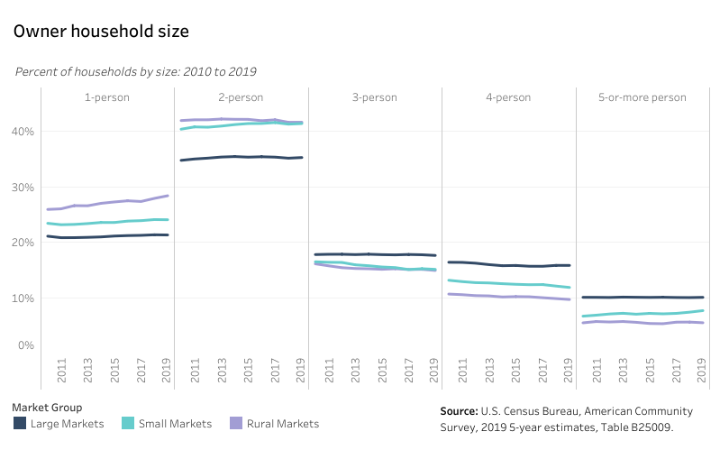

# Homeownership market {#part-3-homeownership}

:::{.open data-latex=""}
This chapter analyzes the state’s homeownership market and current characteristics of Virginians who own their home or are seeking to purchase a home.
:::

## Highlights {.unlisted .unnumbered}

Major takeaways in this chapter include:

* Virginia’s homeownership rate is consistently higher than the national average, but may continue recent declines without a proactive response to changing demographics and market conditions.
* Compared to the average Virginian, homeowners in the Commonwealth are older, more affluent, and more white. In many Small and Rural Markets, most homeowners are more than 55 years old.
* As of August 2021, the average single-family home in Virginia sold for $355,000---an increase over 30 percent from five years prior. Home prices are rising far faster than renters’ average incomes.
* Limited supply---especially of smaller homes equally sought after by young buyers and downsizing baby boomers---has lifted prices and kept homeownership out of the reach of many.
* Homeowners are less likely to be cost-burdened than renters. However, homeowners who are low-income, who live alone, or who are Black and brown are all disproportionately cost-burdened.

## Virginia’s homeowners

### Finding 1: Three in four homeowners live with their family. {.unlisted .unnumbered}

#### Rural homeowners are slightly more likely to live alone. {.unlisted .unnumbered}

```{r owner-01, fig.cap="Owner household types"}
if (knitr::is_html_output()) {
knitr::include_url(url = "https://public.tableau.com/views/HB854-InventoryandProduction-Overcrowdingbytenure/over_db?:showVizHome=no&:embed=true", height = "500px")
} else {}
```

Married-couple households are much more likely to be able to afford a home because of the additional income when both spouses are in the paid workforce. This holds true particularly in Virginia’s Large and Small Markets, where over half of homeowners are in married-couple households. Married-couple households are also the most common living arrangement in Rural Markets (56 percent), but rural residents are more likely than their Large and Small Market counterparts to live with other family members (13 percent) or alone (28 percent).

### Finding 2: Most homeowners live in one-person or two-person households. {.unlisted .unnumbered}

#### But unlike renters, homeowners are more likely to share their home than to live alone. {.unlisted .unnumbered}

```{r owner-02, fig.cap="Owner household size"}
if (knitr::is_html_output()) {knitr::include_url(url ="https://public.tableau.com/views/HB854-Homeownership-Ownerhouseholdsize/hhsize_mg_own_db?:showVizHome=no&:embed=true", height = "500px")} else {}
```

Most homeowners in the Commonwealth live in one-person or two-person households, but there are variations in household size across market groups. In Large Markets, Virginia homeowners are much more likely to live in larger households---most likely due to increasing economic opportunities for young families in these areas. Rural and Small Markets have greater shares of smaller households.

### Finding 3: Homeowners are getting older. {.unlisted .unnumbered}

#### Virginia’s oldest homeowners are in rural communities. {.unlisted .unnumbered}

```{r owner-03, fig.cap="Owner household age"}
if (knitr::is_html_output()) {
knitr::include_url(url =
"https://public.tableau.com/views/HB854-Homeowner-Ownerhouseholderage/hhage_mg_own_db?:showVizHome=no&:embed=true", height = "500px")
} else {}
```

The aging of homeowners in Small Metro and Rural Housing Markets is contributing to smaller household sizes. In these areas, residents 55 and older make up a greater share of the population, and they also have increased in number.

Homeowners in Virginia are increasingly older adults; unaffordable home prices have locked out many millennial and younger Generation X would-be homebuyers.

### Finding 4: Homeowners of color are uncommon in Virginia. {.unlisted .unnumbered}

#### Even in diverse markets, over two-thirds of homeowners are white. {.unlisted .unnumbered}

```{r owner-04, fig.cap="Owner race and ethnicity"}
if (knitr::is_html_output()) {
knitr::include_url(url =
"https://public.tableau.com/views/HB854-Homeownership-Ownerraceandethnicity/hhrace_mg_own_db?:showVizHome=no&:embed=true", height = "500px")
} else {}
```

Homeowners in Virginia are more likely to be white, even in diverse areas of the Commonwealth. Although white Virginians make up a majority of the population, the low number of homeowners of color signals a key consequence of centuries of racial inequity.

For example, 21 percent of all households in Large Markets are Black, but they account for only 15 percent of the homeowners.

### Finding 5: Metro homeowners have above-average incomes. {.unlisted .unnumbered}

#### Over half of homeowners in the urban crescent earn more than six figures. {.unlisted .unnumbered}

```{r owner-05, fig.cap="Owner household income"}
if (knitr::is_html_output()) {
knitr::include_url(url =
"https://public.tableau.com/views/HB854-Homeownership-Ownerhouseholdincome/hhinc_mg_own_db?:showVizHome=no&:embed=true", height = "500px")
} else {}
```

Income inequality among homeowners in Virginia is most significant in Large and Small Metro Housing Markets where a greater proportion of homeowners make $100,000 or more across income groups. There is greater income uniformity in Rural Housing Markets where homeowner incomes are distributed almost evenly across all income groups.

### Finding 6: Homeowners are more likely to have a bachelor’s degree or higher in Virginia metro areas. {.unlisted .unnumbered}

#### Over half of homeowners in the urban crescent have a bachelor’s degree or higher. {.unlisted .unnumbered}

```{r owner-06, fig.cap="Owner educational attainment"}
if (knitr::is_html_output()) {
knitr::include_url(url =
"https://public.tableau.com/views/HB854-Homeownership-Ownereducationalattainment/ed_own_db?:showVizHome=no&:embed=true", height = "500px")
} else {}
```

Higher educational attainment often leads to higher income and with it, greater ability to afford a home. In Virginia, disparities in homeownership among residents of different educational backgrounds are more pronounced in Large Markets. Over half of homeowners (53 percent) in the urban crescent and just over one in three Small Market homeowner households have a bachelor’s degree or higher.

## Homeownership rate

### Finding 1: Prior to COVID-19, homeownership in Virginia was increasing for the first time in more than a decade. {.unlisted .unnumbered}

#### Recovery from the Great Recession and the increase in renting has slowed the rate of homeownership across most of the country. {.unlisted .unnumbered}

```{r owner-07, fig.cap="Homeownership rate in Virginia"}
if (knitr::is_html_output()) {
knitr::include_url(url =
"https://public.tableau.com/views/HB854-Homeowner-HomeownershiprateinVirginia/horate_db?:showVizHome=no&:embed=true", height = "500px")
} else {}
```

From 2010 to 2016, homeownership decreased in many states as they recovered from the impacts of the Great Recession and housing costs rose. Virginia’s homeownership rate---almost 68 percent before the pandemic---was slightly higher than the national average, but a full six points below what it was before 2008.

Virginia’s homeownership rate began to plateau around 2015 following a steady decline since the start of the recession in 2008. By 2018, homeownership was on the rise again until the COVID-19 pandemic hit in early 2020.

Although the U.S. Census Bureau’s homeownership estimates for Virginia were above 72 percent in the second and third quarters of 2020, the rate dropped by more than four points by the first quarter of 2021, followed by another sharp increase of several points. This volatility is likely the result of changed data collection procedures during the pandemic for Housing Vacancies and Homeownership (CPS/HVS) estimates.

### Finding 2: Homeownership has been declining slightly in almost every part of the state. {.unlisted .unnumbered}

#### The biggest drops have been in Large Metro Housing Markets, but that trend may be over. {.unlisted .unnumbered}

```{r owner-08, fig.cap="Homeownership rate by market name"}
if (knitr::is_html_output()) {
knitr::include_url(url =
"https://public.tableau.com/views/HB854-Homeownership-Homeownershipratebymarketname/mg_mn_horate_db?:showVizHome=no&:embed=true", height = "500px")
} else {}
```

Homeownership in Virginia is most prevalent in Rural Markets, followed by Large Markets and then Small Markets. However, in nearly every market homeownership rates continued to decline in the years following the Great Recession. While that drop is beginning to level off in Large Markets and some Small Markets, homeownership in most rural areas is still decreasing.

### Finding 3: The racial homeownership gap remains wide in Virginia. {.unlisted .unnumbered}

#### Throughout Virginia, non-white households are far less likely to be homeowners---but Virginia’s Black and brown homeownership rates are better than the national average. {.unlisted .unnumbered}

```{r owner-09, fig.cap="Homeownership rate by race and ethnicity"}
if (knitr::is_html_output()) {
knitr::include_url(url =
"https://public.tableau.com/views/HB854-Homeownership-Homeownershipratebyraceandethnicity/mg_race_horate_db?:showVizHome=no&:embed=true", height = "500px")
} else {}
```

The barriers to homeownership for many households of color are deeply rooted in the systemic injustices of Virginia’s and the nation’s past. For generations these injustices have compounded the barriers for Black and brown families to build generational equity and wealth that many white households have been able to pass on to their children and grandchildren. 

The wide homeownership gap between Black and brown households and their white counterparts in all parts of Virginia is a clear holdover from these injustices, especially in Large Markets that experienced redlining. In these communities, the gap has widened to 26 points; white households have a homeownership rate of 73 percent while Black households have a 47 percent homeownership rate.

However, in a national comparsion, Black Virginians are more likely to be homeowners. The national homeownership rate for Black households sits at 42 percent, six percentage points behind the homeownership rate of Black Virginians.

Most racial and ethnic groups generally have experienced a decrease in homeownership except in Small and Rural Markets where Hispanic homeownership rates are increasing significantly. In rural Virginia, Hispanic households have increased their homeownership rate to 52 percent from 40 percent in a decade.

### Finding 4: Fewer millennial and Generation X Virginians are becoming homeowners over time. {.unlisted .unnumbered}

#### There has been an overall decline in homeownership among all age groups, but millennials---who already have a low homeownership rate---have experienced the most significant decreases. {.unlisted .unnumbered}

```{r owner-10, fig.cap="Homeownership rate by age group"}
if (knitr::is_html_output()) {
knitr::include_url(url =
"https://public.tableau.com/views/HB854-Homeownership-Homeownershipratebyagegroup/mg_age_horate_db?:showVizHome=no&:embed=true", height = "500px")
} else {}
```

Statewide, the average homeowner is getting older. Millennials (born between 1981 and 1997) continue to struggle to achieve homeownership. Social and economic factors---such as student loan debt and delayed household formation—are influencing this development. Delayed homeownership can contribute significantly to growing inequity between younger and older generations. 

Throughout Virginia the homeownership gap between millennials and older age groups is 20 percent or greater. This holds true in Small and Rural Markets as well as in Large Markets where housing costs are rapidly increasing.

The number of Generation X homeowners (those born between 1965 and 1980) has also been declining across all markets, though not as dramatically as for millennials. The decline may indicate a new preference for renting, but it also reflects increasing barriers to homeownership such as debt accumulation, rising housing costs, and low supply of homes for sale.

## Home prices and supply

### Finding 1: It is hard to buy a home in Virginia today. {.unlisted .unnumbered}

#### The average home in the state now costs more than $300,000. {.unlisted .unnumbered}

```{r owner-11, fig.cap="Median sales price and months of supply"}
if (knitr::is_html_output()) {
knitr::include_url(url =
"https://public.tableau.com/views/HB854-Homeownership-Medianpriceandsupply/msp_ms_db?:showVizHome=no&:embed=true", height = "500px")
} else {}
```

Home prices in Virginia steadily recovered after the Great Recession. By 2016, the median sales price across the state regularly exceeded $250,000. In the summer of 2017, the average home price cracked $300,000 for the first time. Initial fears about a slump during the pandemic in 2020 were soon dispelled as average prices stayed well above $310,000, driven by historically low interest rates, low inventory, and a homebuyer pool relatively unscathed by pandemic job losses.

High demand for nearly all types of housing has dramatically reduced available supply. Before 2016, Virginia was comfortably above six months of supply. That figure soon began to decline, and was just above one month in early 2021.

### Finding 2: Starter home inventory is decreasing. {.unlisted .unnumbered}

#### Homes affordable to buyers earning less than 80 percent AMI are becoming hard to find. {.unlisted .unnumbered}

```{r owner-12, fig.cap="Availability of starter homes in Virginia"}
if (knitr::is_html_output()) {
knitr::include_url(url =
"https://public.tableau.com/views/HB854-Homeownership-StarterhomessoldinVirginia/starter_home_mn_db?:showVizHome=no&:embed=true", height = "500px")
} else {}
```

In all parts of Virginia except for the Southwest, the number of homes that are affordable to households making 80 percent AMI has decreased since 2013. These "starter homes" are generally smaller and slightly older, making them traditionally more affordable than newer homes coming onto the market.

In Arlington County, for example, 80 percent AMI equated to an annual household income of $65,850 in fiscal year 2021. The maximum home price affordable to these households was $356,745, but in fiscal year 2021 only 16 percent of homes sold were at or below this price. Conversely, in the city of Petersburg, where 80 percent AMI was $57,600, 97 percent of homes sold in fiscal year 2021 were at $312,050 or below.

The most pronounced market decreases in starter home stock have occurred in the Northern Valley (20 percent decrease), Central Valley (17 percent decrease), and Chesapeake Bay Markets (16 percent decrease). In Northern Virginia, where the percentage of starter homes was already low at 27 percent, the share of starter homes has declined to just above 20 percent.

### Finding 3: New home sizes are not matching the need for starter homes. {.unlisted .unnumbered}

#### The number of owner-occupied homes with four or more bedrooms has been rising, while smaller homes have been decreasing. {.unlisted .unnumbered}

```{r owner-13, fig.cap="Owner housing units by number of bedrooms"}
if (knitr::is_html_output()) {
knitr::include_url(url =
"https://public.tableau.com/views/HB854-Homeownership-Changeinownerhousingunitsbynumberofbedrooms/mg_br_chg_db?:showVizHome=no&:embed=true", height = "500px")
} else {}
```

Fewer bedrooms in a home often mean a more affordable price. But the share of owner housing units with fewer than four bedrooms has largely been in decline in Virginia, except in rural areas where the number of single room occupancy or one bedroom homes has been on the rise since 2012. 

The decline of homes with fewer bedrooms means fewer options for young, single, and/or first-time home buyers, but also for low- and moderate-income couples just starting a family.

### Finding 4: Virginia's supply of manufactured homes, a vital path to affordable homeownership, is declining. {.unlisted .unnumbered}

#### Lower cost factory-built homes are less common today than in the past. {.unlisted .unnumbered}

```{r owner-14, fig.cap="Owner housing units by structure type"}
if (knitr::is_html_output()) {
knitr::include_url(url =
"https://public.tableau.com/views/HB854-Homeownership-Ownerhousingunitsbystructuretype/mg_structure_chg_db?:showVizHome=no&:embed=true", height = "500px")
} else {}
```

The number of owner-occupied manufactured homes has declined sharply across the Commonwealth, especially in rural Virginia where the manufactured homes segment of owner-occupied housing stock dropped from nearly 20 percent to just 16 percent in 2019.  

While the reduction of low-quality manufactured homes is an overall good for many communities, manufactured homes are not being replaced with newer, better quality manufactured homes. 

Modern manufactured homes are not only an affordable alternative to traditional site-built homes, but their quality is far from that of their pre-1980 predecessors. In spite of these benefits, manufactured homes continue to carry the stigma of undesirable, unsafe housing that doesn not hold its value. Yet 21st century manufactured housing offers the promise of homeownership to those for whom it is otherwise out of reach and a solution to the affordable housing crisis, particularly as the cost of site-built construction rises.

## Affordability

### Finding 1: Cost burden among low-income homeowners remains high. {.unlisted .unnumbered}

#### The share of cost-burdened very low-income and extremely low-income homeowners has largely remained unchanged since 2010. {.unlisted .unnumbered}

```{r owner-15, fig.cap="Owner cost burden by income"}
if (knitr::is_html_output()) {
knitr::include_url(url =
"https://public.tableau.com/views/HB854-Homeownership-Ownercostburdenbyincome/cb_income_db?:showVizHome=no&:embed=true", height = "500px")
} else {}
```

Housing cost burden for homeowners making more than 50 percent AMI has been decreasing across Virginia, but this trend does not hold for homeowners with lower incomes. The share of homeowners making 50 percent AMI or less who are cost-burdened has remained steady since 2010.

Worse yet, over half of ELI homeowners (57 percent) are severely cost-burdened (spending more than half of their income on housing costs). For these households, staying stably housed is critical when incomes are already barely enough to cover the basic necessities. 

While improving housing affordability for these households is an important piece of the puzzle, improving overall economic conditions for ELI and VLI households must be a priority. One major issue is the lack of savings and retirement income that makes rising property taxes, utilities, and repairs a heavy burden for older homeowners. Their income post-retirement is insufficient to cover ongoing housing costs, especially if they still carry a mortgage and/or have significant deferred maintenance. When these difficulties are compounded by the death of a spouse and the loss of their income, single-owner households face exceptionally high cost burdens. 

### Finding 2: Homeowners living alone are disproportionately cost-burdened. {.unlisted .unnumbered}

#### The lack of extra income from a partner or family member drastically impacts homeowners in Virginia. {.unlisted .unnumbered}

```{r owner-16, fig.cap="Owner cost burden by household type"}
if (knitr::is_html_output()) {
knitr::include_url(url =
"https://public.tableau.com/views/HB854-Homeownership-Ownercostburdenbyhouseholdtype/cb_hhtype_db?:showVizHome=no&:embed=true", height = "500px")
} else {}
```

The share of senior homeowners (62 years or over) living alone who are cost-burdened---35 percent in 2017---has largely remained the same since 2010 (36 percent). Senior homeowners living alone also have the greatest percentage of severely cost-burdened households at 17 percent in 2017.

Households with single adults (below 62 years old) living alone or sharing a home with non-relatives experience substantial cost burden. In 2017, nearly a third of non-elderly, non-family households (32 percent) were cost-burdened---a decrease from 39 percent in 2010, but still a significant portion of households.

:::{.info data-latex=""}
A **non-family** household is a single-person living alone or where that person shares a home with people to whom they are not related. For example, a single adult living alone or three college students renting an off-campus apartment are both considered non-family households.
:::

Cost burden has decreased since 2010 for most household types, but not for seniors. Senior homeowners living alone *and* those living with family members have seen very little change in their share of cost-burdened households.

### Finding 3: Black and Hispanic homeowners are disproportionately cost-burdened. {.unlisted .unnumbered}

#### All homeowners of color are more likely to be cost-burdened than their white counterparts. {.unlisted .unnumbered}

```{r owner-17, fig.cap="Owner cost burden by race and ethnicity"}
if (knitr::is_html_output()) {
knitr::include_url(url =
"https://public.tableau.com/views/HB854-Homeownership-Ownercostburdenbyraceandethnicity/cb_race_db?:showVizHome=no&:embed=true", height = "500px")
} else {}
```

Cost-burdened households put homeowners and their families at risk when they must make difficult choices between making a mortgage payment or putting food on the table. As of 2017, just over 22 percent of all homeowners in Virginia were cost-burdened.

The rate of cost-burdened households is much higher for Hispanic homeowners (31 percent) and Black homeowners (30 percent) than it is for white homeowners (20 percent). All other minorities also have higher-than-average homeowner cost burden rates.

The rate of cost-burdened households among homeowners of color has declined since 2010; the likeliest cause of this change is the transition of previously cost-burdened homeowners to becoming renters as the result of the foreclosure crisis and subsequent recession. 

### Finding 4: Renter incomes are barring households from reaching homeownership. {.unlisted .unnumbered}

#### In almost every locality in Virginia, there is a major gap between the median renter household income and the income needed to afford the median home price. {.unlisted .unnumbered}

```{r owner-18, fig.cap="Income needed to afford median home prices"}
if (knitr::is_html_output()) {
knitr::include_url(url =
"https://public.tableau.com/views/HB84-Homeownership-Incomeneededtoaffordmedianhomeprices/medsales_income_db?:showVizHome=no&:embed=true", height = "500px")
} else {}
```

Having an adequate income is crucial to securing a home mortgage, but many renters’ current income falls far short of the income needed to afford the median home price. In localities where there are large renter populations, the gap is especially wide. 

Homeownership is still often out of reach even in localities where median renter household income is high; in Fairfax County the median renter household income is $80,858, but in the fourth quarter of 2019 a renter needed an income of $114,473 to afford the median home price. The affordability and income gap exacerbate inequities for the large number of Black and brown renters. 

## Mortgage trends

### Finding 1: Black and Multiracial home mortgage applicants in Virginia are twice as likely to be denied a loan than white applicants. {.unlisted .unnumbered}

#### Barriers to a home mortgage will continue to perpetuate inequities in homeownership if not addressed. {.unlisted .unnumbered}

```{r owner-19, fig.cap="Denial rates for mortgage applications by race"}
if (knitr::is_html_output()) {
knitr::include_url(url =
"https://public.tableau.com/views/HB854-Homeownership-Denialratesformortgageapplicationsbyrace/denial_rate_db?:showVizHome=no&:embed=true", height = "500px")
} else {}
```

In 2020, white applicants received 80 percent of approved home purchase loans while Black applicants received just 10 percent of approved home purchase loans. 

Black applicants are disproportionately denied a loan in Virginia compared to white applicants. In 2020, Black applicants had a denial rate of 12 percent followed by Multiracial applicants at 11 percent, while the denial rate for white applicants was six percent.

### Finding 2: High debt levels and poor credit are the biggest barriers for Virginians looking to buy a home. {.unlisted .unnumbered}

#### Over half of applicants for a home purchase loan were denied due to either their debt-to-income ratio or their credit history. {.unlisted .unnumbered}

```{r owner-20, fig.cap="Principal loan denial reason by race"}
if (knitr::is_html_output()) {
knitr::include_url(url =
"https://public.tableau.com/views/HB854-Homeownership-Principaldenialreason/denial_reason_db?:showVizHome=no&:embed=true", height = "500px")
} else {}
```

Regardless of an applicant’s race, debt-to-income (DTI) ratio and credit history were the most cited reasons that a lender denied an application for a home purchase loan in Virginia. DTI represents the combination of inadequate wages and common types of debt like student loans that hinder many Virginians’ homeownership aspirations.  

When a lender cites an applicant’s credit history as a reason for a loan application denial, it does not necessarily indicate past failure to make payments on debt; instead it sometimes is evidence of the "credit invisibility" that saddles individuals with little to no credit history. According to the Consumer Financial Protection Bureau, this invisibility is much more common among Black and Hispanic Americans. [@brevoort2015]

Although DTI and credit history were the major reasons for loan denial for all racial groups, Black Virginians are six percent more likely to be denied a loan because of their DTI and seven percent more likely to be denied a loan due to their credit history than are white Virginians.

### Finding 3: Black millennials are less likely to receive a home purchase loan than their counterparts. {.unlisted .unnumbered}

#### Only 61 percent of originated loans for Black applicants were for an applicant younger than 45 years old. {.unlisted .unnumbered}
 
```{r owner-21, fig.cap="Loan origination by age and race"}
if (knitr::is_html_output()) {
knitr::include_url(url =
"https://public.tableau.com/views/HB854-Homeownership-Loanoriginationbyageandrace/lo_age_db?:showVizHome=no&:embed=true", height = "500px")
} else {}
```

Purchasing a home later in life has major implications for long term wealth-building; delayed homeownership for Black Virginians and the lower number of young Black homeowners will contribute to the Commonwealth’s persistent racial wealth gap for generations. Although millennials garnered the majority of loans (61 percent) of all Black applicants from 2018 to 2020, all other racial groups exceeded this rate for the same age category.
