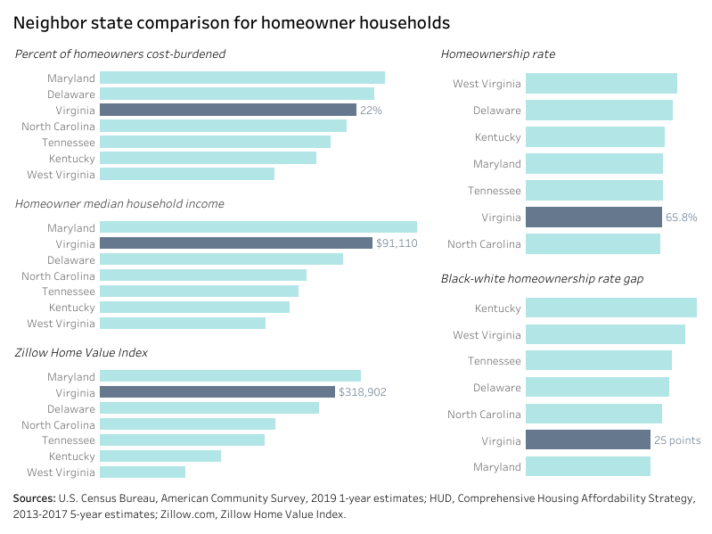
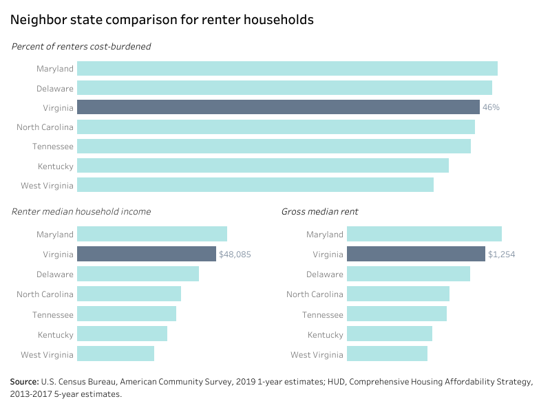

# Neighbor state comparisons {#part-3-neighbors}

:::{.open data-latex=""}
This chapter compares Virginia’s challenges and progress on housing affordability with its neighboring states in the South and Mid-Atlantic. The data contextualizes the Commonwealth’s current situation for a broader perspective.
:::

## Homeownership affordability

```{r neighbor-01, fig.cap="Neighbor state comparisons for homeowner households"} 
if (knitr::is_html_output()) {
knitr::include_url(url =
"https://public.tableau.com/views/StateHomeownerComparisonDashboard/states_owner_db?:showVizHome=no&:embed=true", height = "600px")
} else {}
```

Virginia ranks third out of seven states for homeowners who are cost-burdened. One in five homeowner households in Virginia were cost-burdened in 2017; in Maryland nearly one in four homeowners were cost-burdened as were barely one in four homeowners in Delaware.

Virginia had the second highest median household income for homeowners in 2019 at $91,110 and the second highest Zillow Home Value Index (a measure of the typical home value) at $318,902.

Virginia has a lower homeownership rate compared to its neighbors in the Mid-Atlantic and the South---except for North Carolina---but Virginia’s Black-white homeownership gap is narrower than it is in North Carolina.

## Rental affordability

```{r neighbor-02, fig.cap="Neighbor state comparison for renter households"} 
if (knitr::is_html_output()) {
knitr::include_url(url =
"https://public.tableau.com/views/StateRenterComparisonDashboard/states_renter_db?:showVizHome=no&:embed=true", height = "600px")
} else {}
```

Although Virginia has relatively higher renter household incomes than a majority of its neighbors, its rents are also comparatively high.

Median renter household income---$48,085---is higher than that of Virginia’s neighbors, but it is only about half that of Virginia’s homeowner median household.
