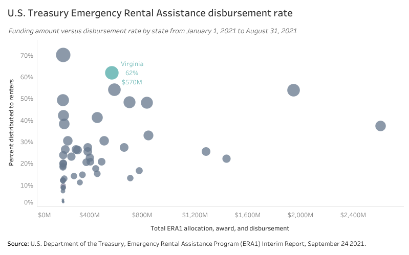
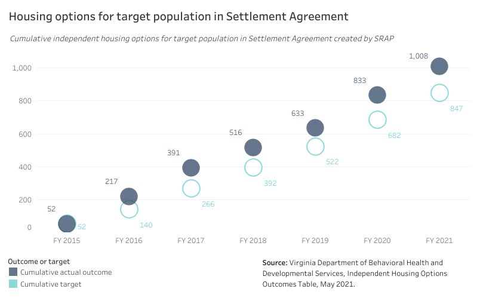
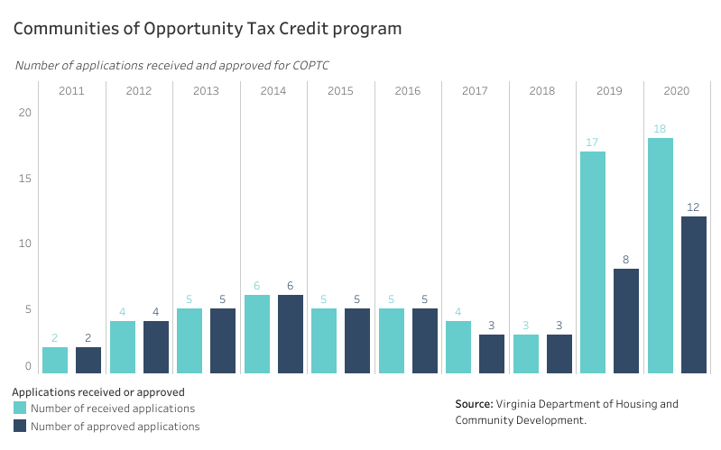
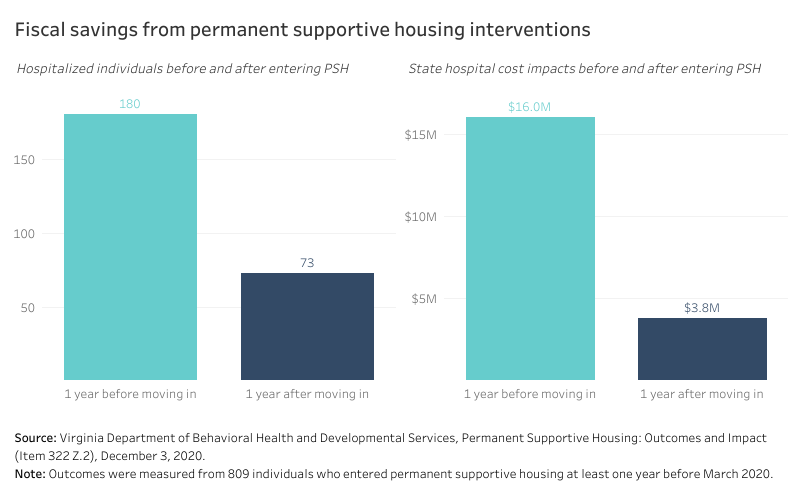

# Rental assistance and eviction prevention {#part-4-rentalassistance}

:::{.open data-latex=""}
This chapter covers six programs that provide direct assistance to renters, including efforts created specifically to reduce evictions.
:::

## Highlights {.unlisted .unnumbered}

Major takeaways in this chapter include:

* Virginia’s array of programs has a track record of achievement before and since the COVID-19 public health crisis, with most assistance reaching Very Low-Income households.
* DHCD’s Rent Relief Program far outpaced other states in its rapid disbursement of federal Emergency Rental Assistance funds in 2021.
* DBHDS’s State Rental Assistance Program has consistently outmatched its own goals for providing housing assistance to renters with developmental disabilities so they can live within communities.
* The Communities of Opportunity Tax Credit Program, designed to serve metro areas, has untapped potential that new source of income protections may redirect.
* Primary challenges for these programs include long wait lists, restrictive eligibility criteria, and a decline in quality market affordable housing.
* Supporting a state-funded, non-emergency rental assistance program, continuing to invest in DBHDS housing assistance programs, reducing barriers to assistance, and leveraging new source of income protections will further help many renters in Virginia stay stably housed during increase, as well as increase economic opportunity.

## Programs in this grouping {.unlisted .unnumbered}

**Virginia Housing**

* [Housing Choice Voucher (Virginia Housing-administered)](http://www.hb854housingstudy.org/pdf/vh-hcv.pdf)

**Department of Housing and Community Development**

* [Communities of Opportunity Tax Credit (COPTC)](http://www.hb854housingstudy.org/pdf/dhcd-coptc.pdf)
* [Virginia Eviction Reduction Pilot (VERP)](http://www.hb854housingstudy.org/pdf/dhcd-verp.pdf)
* [Virginia Rent Relief Program (RRP)](http://www.hb854housingstudy.org/pdf/dhcd-rrp.pdf)

**Department of Behavioral Health and Developmental Services**

* [Permanent Supportive Housing - Serious Mental Illness](http://www.hb854housingstudy.org/pdf/dbhds-psh.pdf)
* [State Rental Assistance Program (SRAP)](http://www.hb854housingstudy.org/pdf/dbhds-srap.pdf)

**Virginia Department of Social Services**

* [Low-Income Home Energy Assistance Program (LIHEAP)](http://www.hb854housingstudy.org/pdf/dss-liheap.pdf)

## Findings

:::{.open data-latex=""}
These findings are based on data provided by Virginia Housing, DHCD, and other sources on the scale of these programs, demographic information on their beneficiaries, and other trends.
:::

### Finding 1 {.unlisted .unnumbered}

##### Virginia has been a leader in its disbursement of Emergency Rental Assistance funds through the Virginia Rent Relief Program. {.unlisted .unnumbered}

```{r prog-assist-01, fig.cap="Emergency Rental Assistance funding and disbursement by state"} 
if (knitr::is_html_output()) {
knitr::include_url(url =
"https://public.tableau.com/views/HB854-AnalysisofExistingPrograms-U_S_TreasuryEmergencyRentalAssistance/era_db?:showVizHome=no&:embed=true", height = "500px")
} else {}
```

In its Emergency Rental Assistance Program (ERA) Monthly Compliance Report, the U.S. Treasury data compared the program’s first-round (ERA 1) total Allocation, Award, and Disbursement to the total rent, rental arrears, and utilities paid; the comparison demonstrated that Virginia’s Rent Relief Program (RRP) led a majority of states in its disbursement rate (62 percent).

While this does not account for funds disbursed before January 2021, Virginia’s rapid disbursement of rent relief funds has been exemplary. As of October 31, 2021, the RRP has served more than 70,900 unique low-income households.

### Finding 2 {.unlisted .unnumbered}

##### Since its launch in 2015, Virginia has consistently exceeded its target in providing community-based, independent housing for persons with developmental disabilities that were covered by the Settlement Agreement. {.unlisted .unnumbered} 

```{r prog-assist-02, fig.cap="Housing options for target population in Settlement Agreement"} 
if (knitr::is_html_output()) {
knitr::include_url(url =
"https://public.tableau.com/views/HB854-AnalysisofExistingPrograms-SRAP/srap_db?:showVizHome=no&:embed=true", height = "500px")
} else {}
```

Virginia’s Department of Behavioral Health and Developmental Services has consistently exceeded its target outcome for the number of adults in the Target Population of the Settlement Agreement living in independent housing.^[In 2012, the Commonwealth and the Department of Justice entered a Settlement Agreement following a civil rights investigation into state institutions for persons with developmental and intellectual disabilities. The Final Order and Settlement Agreement, along with annual reports, are available on the [DBHDS website](https://dbhds.virginia.gov/doj-settlement-agreement).]

DBHDS has been able to do this thanks to the State Rental Assistance Program (SRAP), which provides tenant-based rental assistance to individuals with developmental disabilities (IDD) so that they may live integrated within communities.

SRAP has been able to take pressure off Virginia Housing-administered Housing Choice Vouchers and local PHA Housing Choice Vouchers, which had supported the IDD population. 

### Finding 3 {.unlisted .unnumbered}

##### Even before source of income protections were enshrined in state law, the Communities of Opportunity Tax Credit Program was underutilized. {.unlisted .unnumbered}

```{r prog-assist-03, fig.cap="Communities of Opportunity Tax Credit program"} 
if (knitr::is_html_output()) {
knitr::include_url(url =
"https://public.tableau.com/views/HB854-AnalysisofExistingPrograms-COPTC/coptc_db?:showVizHome=no&:embed=true", height = "500px")
} else {}
```

The Communities of Opportunity Tax Credit Program (COPTC) operates in Virginia’s three major metropolitan areas where HCV recipients are concentrated. However, the program has consistently received a low number of applications with an increase only in the past two years. New source of income protections offer an opportunity to redirect the COPTC toward encouraging landlords to increase unit energy efficiency and affordability.^[[HB6](https://lis.virginia.gov/cgi-bin/legp604.exe?201+sum+HB6) Virginia Fair Housing Law; unlawful discriminatory housing practices, sources of funds. 2020 Regular Session, Virginia General Assembly.]

### Finding 4 {.unlisted .unnumbered}

##### Successful investments in supportive housing assistance lead to significant reductions in state hospital costs. {.unlisted .unnumbered}

```{r prog-assist-04, fig.cap="Fiscal savings from permanent supportive housing interventions"} 
if (knitr::is_html_output()) {
knitr::include_url(url =
"https://public.tableau.com/views/HB854-AnalysisofExistingPrograms-PSH-SMI/psh_db?:showVizHome=no&:embed=true", height = "500px")
} else {}
```

PSH-SMI follows national best practices that help reduce costs outside of homelessness systems. In Virginia, a recent DBHDS study showed that the state hospital costs for a cohort of 809 individuals who entered supportive housing at least one year before March 2020 were reduced by 76 percent one year after moving into supportive housing. This equated to a total state hospital cost reduction of more than $12.2 million and a 59 percent reduction in hospitalizations from 180 to 73 after move-in. [@dbhds2020]

## Program successes

:::{.open data-latex=""}
These successes are based on feedback collected from the statewide provider survey, focus groups, and conversations with experienced users of these programs.
:::

### Success 1 {.unlisted .unnumbered}

##### Tenant-based rental assistance in Virginia reaches households most-in-need. {.unlisted .unnumbered}

The majority of households served by Virginia’s tenant-based rental assistance programs make 50 percent AMI or below. These households benefit greatly from resources that assist them in remaining stably housing---lowering the risk of eviction and homelessness.

### Success 2 {.unlisted .unnumbered}

##### Virginia has been a national leader in its efforts to disburse emergency rental assistance in response to COVID-19. {.unlisted .unnumbered}

Although some survey respondents and focus group participants had issues with the initial deployment of Virginia’s RRP, Virginia has been able to quickly disburse Emergency Rental Assistance funds from the U.S. Treasury. Virginia has disbursed funds to over 70,900 households, most of which are households at 50 percent AMI or below.

Virginia has consistently ranked in the top tier of states for expenditure of funds by deploying a dual track design that engages both housing agencies---one responsible for direct assistance to individual renters and the other for larger scale transactions with landlords that include payments for rent in arrears for multiple tenants. 

### Success 3 {.unlisted .unnumbered}

##### Virginia’s response to the eviction crisis has been historic, even before COVID-19. {.unlisted .unnumbered}

In November 2018, Governor Northam signed [Executive Order 25](https://www.governor.virginia.gov/media/governorvirginiagov/executive-actions/EO-25-Establishing-The-Governors-Affordable-Housing-Priorities-To-Address-Virginias-Unmet-Housing-Needs.pdf) (PDF) that set several housing priorities for Virginia, including reducing the rate of evictions. The order cited eviction reduction initiatives such as  "diversion and prevention programs," "potential pilot programs that provide eviction relief," and "counseling and education services." 

The General Assembly  passed additional legislation during the 2019 legislative session to mitigate evictions by requiring landlords to provide written leases, extending the time tenants can pay their rents, and limiting actions that landlords can take against a tenant.

Three years before Governor Northam’s Executive Order, Governor McAuliffe announced that Virginia was the first state in the nation to meet HUD’s criteria for "effectively ending veteran’s homelessness." This meant that Virginia had put systems in place that would immediately make assistance available to any veteran who became homeless.  

During the 2020 Special Session, the General Assembly and the Governor allocated $3.3 million to implement a Virginia Eviction Reduction Pilot (VERP). This program focuses on local and regional systems to prevent evictions. The pandemic delayed final approval of the $3.3 million until fall of 2020 and the implementation of VERP until March 2021. Therefore, an evaluation of VERP was not completed as part of this report.

## Program challenges

:::{.open data-latex=""}
These challenges are based on feedback collected from the statewide provider survey, focus groups, and conversations with experienced users of these programs.
:::

### Challenge 1 {.unlisted .unnumbered}

##### Over 32,000 applicants remain on HCV waitlists due to limited federal program funding. {.unlisted .unnumbered}

The [HB854 public housing authority survey](#part-2-phasurvey) indicated that as of early 2021 there were over 32,000 applicants on HCV waitlists; this count did not include the waitlists of eleven additional PHAs that did not respond to the survey.  Many of these waitlists have been closed for years. Limited federal funding for the program prevents additional HCV allocation, leaving tens of thousands of low-income Virginians without assistance.

### Challenge 2 {.unlisted .unnumbered}

##### Eligibility criteria for HCVs can be too restrictive. {.unlisted .unnumbered}

Stakeholders, survey respondents, and focus group participants that work with HCVs often cited the restrictive eligibility criteria of the federal HCV program. These restrictions include criminal background restrictions and immigration status, which prevent assistance from reaching households that are at risk of housing instability and related crises that further jeopardize their economic and social well-being.   

### Challenge 3 {.unlisted .unnumbered}

##### The effectiveness of rental assistance depends on greater access to affordable units. {.unlisted .unnumbered}

The substantial shortfall of rental assistance to meet the demand of low-income Virginians is not the only impediment to its success. The inadequate supply of affordable housing units is the most urgent challenge to the program’s effectiveness; voucher holders competing on the open market simply have too few options. They may fail to find a home, settle  for a less desirable neighborhood, opt for a home with chronic maintenance needs or substandard conditions, or select a home with a rent above the payment standard. This last possibility means that a household could still be rent-burdened despite the HCV. 

### Challenge 4 {.unlisted .unnumbered}

##### The quality and quantity of market-rate affordable housing ("naturally occurring affordable housing" or NOAH) is declining. {.unlisted .unnumbered}

Across Virginia, older rental units---which are often affordable because market dynamics drive their prices lower---are continuously aging. The declining quality of these homes impacts residents’ health and quality of life, but it also often means that housing costs are higher due to an aging home’s deteriorating condition and outdated systems. Owners face the choice of either raising rents to cover the costs of maintenance and upgrades or redeveloping the properties, further shrinking the supply of affordable housing. In fast-growing areas of the Commonwealth like Northern Virginia, this trend has already led to major losses in the supply of lower-cost, unsubsidized apartments.

Many rental assistance recipients occupy these "Class B" and "Class C" buildings, which are [far more common](https://noahimpactfund.com/impact-investing-affordable-housing-minnesota/what-is-noah/) than affordable apartments with project-based rent subsidies in Virginia and across the country. 

This challenge also extends to older single-family and manufactured home rentals in rural Virginia, which often have high levels of deferred maintenance that lead to poor living conditions.

### Challenge 5 {.unlisted .unnumbered}

##### Geographic coverage for local HCV providers can complicate voucher delivery. {.unlisted .unnumbered}

Local providers of HCVs administered by Virginia Housing have significant overlap in their geographic coverage. Several localities in Central Virginia and the Middle Peninsula are served by two or even three local providers. This agency overlap in multiple localities can cause  redundancies and confusion for potential clients.

## Recommendations

:::{.open data-latex=""}
These recommendations synthesize the findings, successes, and challenges identified for this cluster of programs. They offer a roadmap to a future where these state initiatives effectively and efficiently serve Virginians who need greater housing opportunities.
:::

### Recommendation 1 {.unlisted .unnumbered}

##### Virginia Housing should explore national best practices for project-basing some Virginia Housing administered HCVs. {.unlisted .unnumbered}

**Why this is needed:**

* Project basing of HCVs is a strategy to incentivize the development of new or rehabilitated housing that expands the supply of high quality affordable apartments. Virginia Housing should explore national best practices for project-basing some of their HCVs to help develop a reliable supply of place-based affordable rental units. This would ensure a steady supply of deeply affordable rental units in the jurisdictions of local voucher administrators, which often serve less populous areas with fewer rental options than urban PHAs. 
* Most PHAs in the state follow a practice of allocating a portion of their HCVs to project-based housing. In some cases, these PHAs conduct an RFP for vouchers in advance of the annual LIHTC application cycle. This has the benefit of locking in some LIHTC units as deeply affordable because of the rental assistance.

**Who is responsible:**

* Virginia Housing
* Local HCV administrators

**How to accomplish:**

Stakeholders suggest that Virginia Housing consult with other statewide HCV administrators to weigh the benefits and the drawbacks of implementing project-basing. Virginia Housing should also examine the impact on housing supply, especially the ability to stimulate new construction in areas with a severe supply shortage.

Localities that serve as administrators should participate in this discussion, which should include the opportunity to target new housing to high-need populations identified by the locality. If approved, Virginia Housing and the local administrator could allocate project-based assistance through jointly offered RFPs. 

### Recommendation 2 {.unlisted .unnumbered}

##### Continue to scale up state funding for the DBHDS SRAP targeted rental assistance programs and to expand populations eligible for assistance. {.unlisted .unnumbered}

**Why this is needed:**

* Virginia’s existing targeted rental assistance programs (State Rental Assistance Program (SRAP) and Permanent Supportive Housing-Serious Mental Illness (PSH-SMI)) have been effective in reducing homelessness for individuals within the Settlement Agreement population.
* By increasing the ability of these proven effective programs to house individuals in the Settlement Agreement and other populations with supportive housing needs, the Commonwealth will not only continue to be in compliance with the Settlement Agreement, but will also help address statewide homelessness and the state psychiatric hospital bed crisis.

**Who is responsible:**

* General Assembly
* Department of Behavioral Health and Developmental Services

**How to accomplish:**

Between 2017 and 2020, the General Assembly allocated between $1.5 million and $2.6 million per year for SRAP out of the general fund. In 2021 SRAP received a large increase in funding, bringing its total budget to nearly $4.7 million. The General Assembly can sustain and expand on this funding level by allocating necessary funds during future state budget cycles.

### Recommendation 3 {.unlisted .unnumbered}

##### Reduce voucher program eligibility barriers for assistance by following best practices from other states. {.unlisted .unnumbered}

**Why this is needed:**

* Easing such barriers (e.g., criminal history and immigration status documentation) would acknowledge racial injustices across other systems and work toward their elimination. When rental assistance is available for persons facing numerous structural challenges---such as Virginians exiting criminal processing systems---they can more steadily focus on finding success with their jobs, family, and community.

**Who is responsible:**

* Virginia Housing 
* Department of Behavioral Health and Developmental Services
* Local HCV administrators

**How to accomplish:**

Virginia’s HCV program should reduce eligibility barriers for assistance by following best practices from other states. The reduction of barriers should also mirror, when possible, the recommendations included for the new state-funded rental assistance program described in [Chapter 26](#part-5-staterental) of this report. Those considerations include immigration status, debt status, eviction record, and other factors that commonly prevent households from receiving rental assistance.

### Recommendation 4 {.unlisted .unnumbered}

##### Support the creation of a state-funded rental assistance program as outlined in Chapter 26 of this report. {.unlisted .unnumbered}

**Why this is needed:**

* A state-funded rental assistance program will help fill the gap in assistance not met by the federal government while continuing to support low-income and moderate-income renter households post-pandemic to prevent evictions and homelessness.

**Who is responsible:**

* Virginia Housing
* Department of Housing and Community Development
* Department of Behavioral Health and Developmental Services
* General Assembly
* Governor

**How to accomplish:**

The administration---through its housing agencies and DBHDS---should work with the General Assembly to enact legislation that creates a state-funded rental assistance program, as recommended in [Chapter 26](#part-5-staterental). That larger state rental assistance program could include a component that serves Virginians with developmental disabilities  or severe mental illness and other populations identified and served by DBHDS’s targeted housing programs. 

### Recommendation 5 {.unlisted .unnumbered}

##### Eliminate or transform the Communities of Opportunity Tax Credit Program. {.unlisted .unnumbered}

**Why this is needed:**

* The COPTC program is small in terms of the amount of tax credits available and has not experienced much demand. Few landlords have applied and been approved to receive credits for their participation in the program. Now that source of income protection is part of Virginia's fair housing law, the program could pivot to other similar efforts that expand housing mobility.

**Who is responsible:**

* General Assembly
* Department of Housing and Community Development

**How to accomplish:**

The COPTC may be eliminated in order to transfer resources to other rental assistance efforts. Alternatively, lawmakers may explore transforming it to operate more effectively in a rental market where source of income protection is now law. The tax credit could instead incentivize other needed actions by landlords and property owners, such as rehabilitating lower-quality apartments and preserving those as below-market units .

Policymakers can choose either option, but each scenario should assure that revisions to this program do not generate unintended consequences.