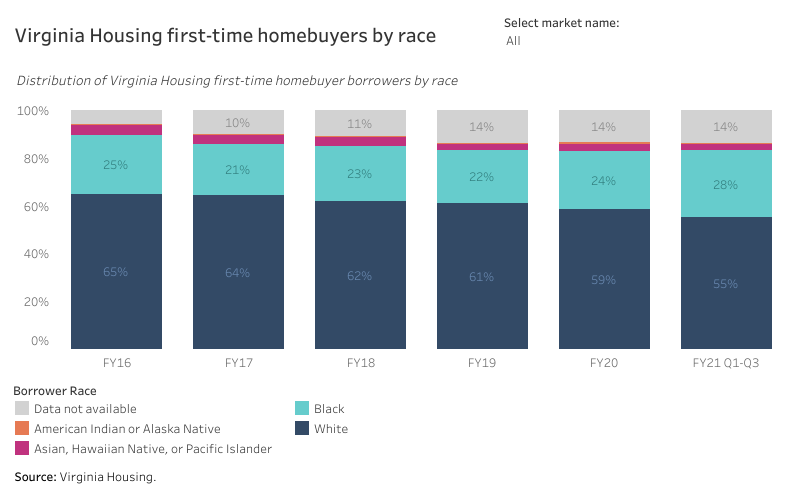
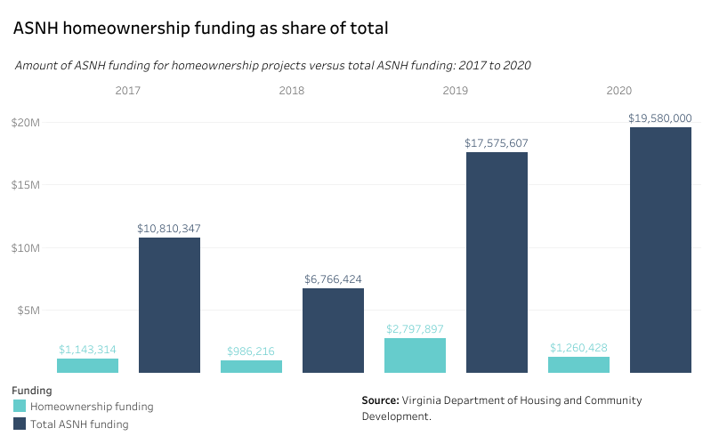
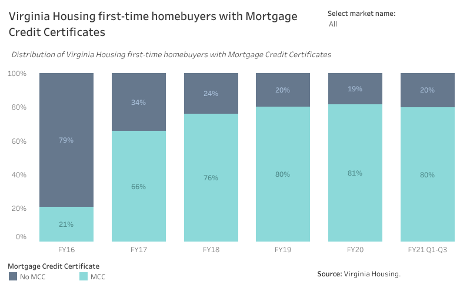

# Homeownership and counseling {#part-4-homeownership}

:::{.open data-latex=""}
This chapter covers seven programs created to expand homeownership among low- to moderate-income households in the Commonwealth.
:::

## Highlights {.unlisted .unnumbered}

Major takeaways in this chapter include:

* The share of Virginia Housing’s first-time homebuyer borrowers of color has been increasing in the last five years. Nearly all Virginia Housing borrowers also now benefit from Mortgage Credit Certificates, a dramatic shift in a short period of time that further lowers housing costs for homeowners.
* Homeownership projects compete with a high number of rental projects for Affordable and Special Needs Housing (ASNH) funds and represent only a small share of that awarded funding.
* For-profit housing developers are an untapped resource among these programs; their participation in ASNH could help boost production.
* Supply and demand shifts continue to stifle greater numbers of first-time buyers. Senior citizens without affordable downsizing options stay in their homes longer, keeping those homes out of the market, while the market cannot produce adequate starter homes and middle-moderate income homes due to restrictive land use policies and other challenges.
* Expanding equitable homeownership opportunities in Virginia can be accomplished by developing a statewide “starter home” initiative, increasing homeownership funding in existing competitive affordable housing programs, expanding outreach to Black institutions and networks, and increasing the involvement of for-profit developers.

## Programs in this grouping {.unlisted .unnumbered}

**Virginia Housing**

* [Homebuyer Education](http://www.hb854housingstudy.org/pdf/vh-homebuyered.pdf)
* [Home Purchase Loans](http://www.hb854housingstudy.org/pdf/vh-homepurch.pdf) / [SPARC](http://www.hb854housingstudy.org/pdf/vh-sparc.pdf)
* [Mortgage Credit Certificates](http://www.hb854housingstudy.org/pdf/vh-mcc.pdf)
* [REACH - Housing Counseling](http://www.hb854housingstudy.org/pdf/vh-reach.pdf)

**Department of Housing and Community Development**

* [Affordable and Special Needs Housing (ASNH)](http://www.hb854housingstudy.org/pdf/dhcd-asnh.pdf)
* [Down Payment Assistance](http://www.hb854housingstudy.org/pdf/dhcd-dpa.pdf)

## Findings

:::{.open data-latex=""}
These findings are based on data provided by Virginia Housing, DHCD, and other sources on the scale of these programs, demographic information on their beneficiaries, and other trends.
:::

### Finding 1 {.unlisted .unnumbered}

##### Virginia Housing has increasingly served first-time homebuyers of color. {.unlisted .unnumbered}

```{r prog-owner-01, fig.cap="Virginia Housing first-time homebuyers by race"} 
if (knitr::is_html_output()) {
knitr::include_url(url =
"https://public.tableau.com/views/HB854-RacialEquity-VirginiaHousingfirst-timehomebuyersbyrace/vh_race_db?:showVizHome=no&:embed=true", height = "500px")
} else {}
```

The share of Virginia Housing’s first-time homebuyer borrowers of color has been increasing in the last five years. Even with a higher percentage of borrowers choosing not to indicate their race, the number of borrowers of color---particularly Black borrowers---receiving Virginia Housing loans has increased from 24 percent in fiscal year 2016 to 27 percent in the first through third quarters of fiscal year 2021.

### Finding 2 {.unlisted .unnumbered}

##### Homeownership awards have represented a small percentage of overall ASNH funding since 2017. {.unlisted .unnumbered}

```{r prog-owner-02, fig.cap="ANSH homeownership funding as share of total"} 
if (knitr::is_html_output()) {
knitr::include_url(url =
"https://public.tableau.com/views/HB854-AnalysisofExistingPrograms-ANSHhomeownershipfunding/asnh_db?:showVizHome=no&:embed=true", height = "500px")
} else {}
```

ASNH began awarding funding to homeownership projects in 2017. However, homeownership project awards have made up a small percentage of total ASNH funding awards---from a high of 16 percent in 2019 to a low of six percent in 2020. This is a result of  homeownership projects competing with a high number of rental projects for ASNH funding.

### Finding 3 {.unlisted .unnumbered}

##### The share of Virginia Housing borrowers taking advantage of Mortgage Credit Certificates has consistently increased. {.unlisted .unnumbered}

```{r prog-owner-03, fig.cap="Virginia Housing homebuyers using MCCs"} 
if (knitr::is_html_output()) {
knitr::include_url(url =
"https://public.tableau.com/views/HB854-AnalysisofExistingPrograms-VirginiaHousingfirst-timehomebuyerswithMortgageCreditCertificates/Dashboard13?:showVizHome=no&:embed=true", height = "500px")
} else {}
```

Early in the rollout of the Mortgage Credit Certificate (MCC) program, fewer than one in four homebuyers with Virginia Housing loans took advantage of the certificate. From 2016 to 2020 that share drastically increased to 80 percent. Today, nearly all Virginia Housing borrowers avail themselves of an MCC.

## Program successes

:::{.open data-latex=""}
These successes are based on feedback collected from the statewide provider survey, focus groups, and conversations with experienced users of these programs.
:::

### Success 1 {.unlisted .unnumbered}

##### Overall, users and administrators feel that homeownership programs work well. {.unlisted .unnumbered}

Virginia Housing and DHCD offer a robust set of programs that assist households seeking homeownership. The stakeholders agreed that these efforts are effectively designed, targeted, and administered. 

### Success 2 {.unlisted .unnumbered}

##### State-level programs have increasingly served households of color. {.unlisted .unnumbered}

In Virginia, there is a significant gap between Black and white homeownership rates. For the past few years, there has been steady progress in increasing the number of persons of color accessing assistance from state homeownership initiatives. 

## Program challenges

:::{.open data-latex=""}
These challenges are based on feedback collected from the statewide provider survey, focus groups, and conversations with experienced users of these programs.
:::

### Challenge 1 {.unlisted .unnumbered}

##### Almost all programs focus on the demand side by assisting with purchase of a home. {.unlisted .unnumbered}

All of the state-level homeownership programs---except for DHCD’s Affordable and Special Needs Housing (ASNH) program and Acquire, Renovate, and Sell (ARS)---focus primarily on improving buyers’ readiness to buy a home. These programs provide support on the demand side of the market.  

However, the supply side of the market lacks adequate existing or under-construction starter homes to meet that demand. Increasing demand side assistance without supply side balance can exacerbate this problem as more buyers chase scarcer and increasingly pricey homes.

### Challenge 2 {.unlisted .unnumbered}

##### Virginia’s major metropolitan areas need more starter homes for first-time and moderate-income buyers. {.unlisted .unnumbered}

Providers working in the homeownership market have consistently mentioned the lack of starter homes for young families and first-time homebuyers. These homes are priced closer to $150,000 and are lacking in Virginia’s major metropolitan areas.

Additionally, there is a shortage of homes priced in the low to mid $200,000s for moderate-income buyers. This amplifies the pressure on the low end of the market because moderate-income buyers who cannot afford to buy above their price range subsequently out-compete lower-income buyers for scarce starter homes.

Local land use policies---including large lot requirements and minimum home sizes---are a major barrier to these home types by constraining the development of smaller, less expensive homes.

### Challenge 3 {.unlisted .unnumbered}

##### Different eligibility requirements and application schedules make it difficult to layer much needed assistance. {.unlisted .unnumbered}

It is often necessary to layer different sources of down payment assistance to meet minimum requirements or to reduce monthly payments. These types of assistance can have different requirements and different application schedules.

For example, the Federal Home Loan Bank (FHLB) of Atlanta’s down-payment program targets specific household types such as veterans and first responders and operates through FHLB partner lending institutions that usually link these to their own loan products. 

### Challenge 4 {.unlisted .unnumbered}

##### Homeownership and rental projects compete side by side for ASNH funding. {.unlisted .unnumbered}

ASNH awards funding to affordable housing developers through a competitive application process with a maximum Virginia Housing Trust Fund loan of $750,000. Homeownership projects compete with rental projects under the same scoring criteria, which makes it difficult for some homeownership projects to garner funding. 

### Challenge 5 {.unlisted .unnumbered}

##### ASNH homeownership awards have been exclusively used by nonprofit developers. {.unlisted .unnumbered}

Since ASNH began funding homeownership projects in 2017, nearly all applicants for homeownership projects have been nonprofit housing developers. For-profit developers have not been active in the program because most are not active in the low-cost starter home market and/or they are less inclined to partner with government programs. Such developers could become an important resource in scaling up ASNH-funded homeownership. 

### Challenge 7 {.unlisted .unnumbered}

##### Student debt and other major underwriting challenges prevent many millennials---especially millennials of color---from achieving homeownership. {.unlisted .unnumbered}

High debt-to-income ratios for young Black households, often due to student debt, are a primary reason for loan denials. Addressing student debt creatively through flexible underwriting is an important objective for many stakeholders. Other sectors of state government must address additional underwriting challenges such as auto debt (through efficient, affordable transportation alternatives) and child care costs (with state support for early childhood development/education). 

There is also a large age gap between white and Black first time buyers: white homebuyers enter the market at much earlier ages. This has significant implications for narrowing the wealth gap because homeownership is the primary path to wealth-building for middle-class Americans, and first time homebuyers in their mid-20s  have an equity advantage over first time homebuyers older by a decade or more. 

### Challenge 8 {.unlisted .unnumbered}

##### Seniors are staying in low value homes longer because they have no affordable alternatives. {.unlisted .unnumbered}

The lack of affordable homes most suitable for seniors has downstream impacts on the homeownership market. Many seniors are staying in low value homes longer because they have no alternatives that are affordable or designed for aging-in-place. This is stalling the flow of lower cost existing homes into the market.

### Challenge 9{.unlisted .unnumbered}

##### There is still a widespread misperception that a mortgage requires a 20 percent down payment. {.unlisted .unnumbered}

Stakeholders pointed out that many aspiring homebuyers believe that they must be able to afford a 20 percent down payment. Expanded education efforts must demonstrate that first time buyers can purchase a home with a much lower percentage  down payment. 

## Recommendations

:::{.open data-latex=""}
These recommendations synthesize the findings, successes, and challenges identified for this cluster of programs. They offer a roadmap to a future where these state initiatives most effectively and efficiently serve Virginians who need greater housing opportunities.
:::

### Recommendation 1 {.unlisted .unnumbered}

### Develop a substantial, statewide starter home initiative with a capital subsidy to reduce the home price.{.unlisted .unnumbered} 

**Why this is needed:**

* Stakeholders and survey respondents noted supply issues related to homes priced for millennials and young families. 
* High land and construction costs, barriers at the local-level, and the higher profitability of more expensive homes are making it more challenging for developers to build smaller-sized homes that are economically feasible.

**Who is responsible:**

* Virginia Housing
* Department of Housing and Community Development
* General Assembly
* Governor
* Homebuilder and REALTOR® associations
* Localities
* Habitat for Humanity and other nonprofit providers

**How to accomplish:**

Important considerations for a statewide starter home program are below.

* The amount of subsidy needed would vary by region.
* The developer would receive the subsidy at the time of construction. 
* The program could be structured similar to the Vibrant Community Initiative as a partnership between Virginia Housing and DHCD, with joint proposals from localities and developers.
* Localities would provide land, greater density, expedited processing, and/or other local incentives.
* To ensure long term benefits, this state investment should place homes in a program that provides for permanent affordability, such as deed restricted, shared equity, or community land trust. The house will remain a starter home for decades and provide homeownership opportunities for many first time buyer households.
* This initiative should launch statewide with a substantial multi-year fund allocation and a goal to produce 1,000 units over three years.

### Recommendation 2 {.unlisted .unnumbered}

##### Create a separate application, scoring template, and funding pool for homeownership proposals within the ASNH program. {.unlisted .unnumbered}

**Why this is needed:**

* The current ASNH design allows for proposals to develop both rental and homeownership projects, but the two compete against each other. 
* Competition between these different types of projects is likely to be inequitable. Rental housing proposals may have an advantage because they typically are able to serve lower incomes and usually leverage significantly more funding than do homeownership proposals. 

**Who is responsible:**

* Department of Housing and Community Development
* Homeownership providers
* Other interested parties

**How to accomplish:**

Stakeholders encourage DHCD to develop greater separation within ASNH between homeownership and rental proposals by working with providers of both to customize the process and make it more specifically relevant to each tenure type. This could include the development of a homeownership work group to advise DHCD on program parameters, application format, and scoring criteria. 

DHCD should also consider establishing a separate funding pool for homeownership proposals within ASNH. This would allow the agency to begin to make fund allocations in proportion to overall goals separately for homeownership and rental housing development. 

### Recommendation 3 {.unlisted .unnumbered}

##### Expand outreach to Black institutions and networks to promote homebuyer education and resources. {.unlisted .unnumbered}

**Why this is needed:**

* There is a homeownership gap in Virginia between Black and white households. This gap has not declined significantly over the past decade and is only marginally better than it was 50 years ago when the Fair Housing Act became law. 
* Outreach customized to Black and Brown homebuyers requires non-traditional avenues and methods. 

**Who is responsible:**

* Virginia Housing
* Department of Housing and Community Development
* Homeownership providers and counselors
* Organizations, churches, and networks within the BIPOC community

**How to accomplish:**

Virginia Housing has implemented an aggressive campaign to reach minority homebuyers over the past few years---including adding new staff dedicated to that assignment. Stakeholders encourage Virginia Housing and partners to continue and expand outreach to Black institutions and networks across the Commonwealth to promote homebuyer education and resources and to glean information about other challenges Black Virginians face when seeking a home.

A suggested strategy elsewhere in this report is to set measurable goals for penetrating this market in terms of counseling, applications, and home purchases. 

### Recommendation 4 {.unlisted .unnumbered} 

##### Recruit more for-profit single-family developers to apply for ASNH homeownership assistance to increase production of lower cost homes. {.unlisted .unnumbered}

**Why this is needed:**

* The ASNH program has been used almost exclusively by nonprofit homeownership organizations like Habitat for Humanity. While these mission driven organizations are an important part of the delivery system for affordable homes, private market participation is needed to bring this program to scale. 
* For-profit developers and homebuilders are generally better capitalized and can build faster than their counterparts in the nonprofit sector.
* There is an extreme shortage of low-cost starter homes in the marketplace. 

**Who is responsible:**

* Department of Housing and Community Development
* Home Builders Association of Virginia (HBAV)
* Other developer and construction associations (e.g., Urban Land Institute)

**How to accomplish:**

DHCD should recruit and direct an advisory group of homebuilders and developers to review the program design and identify barriers to participation. Revisions to the program design should:

* Accommodate the needs of for profit builders and expand outreach and education through the HBAV and local home builder chapters,
* Encourage partnerships between nonprofit providers and for profit developers,
* Recruit localities, builders, counseling organizations, and lenders to partner collaboratively to produce and sell more starter homes, and
* Increase the fund allocation to this program as a further incentive to grow greater levels of industry participation. 

### Recommendation 5 {.unlisted .unnumbered}

##### Conduct assessment of down payment assistance programs to explore further alignment of terms and eligibility across programs. {.unlisted .unnumbered}

**Why this is needed:**

* Many down payment assistance (DPA) programs exist in the state with federal, state, local and private funding. Many of these are not aligned in terms of eligibility, amount of assistance, and application cycles.
* Affordable homeownership providers struggle to layer these sources of assistance together. This can be time consuming and frustrating for the provider and confusing to the homebuyer. 

**Who is responsible:**

* Virginia Housing
* Department of Housing and Community Development
* Down payment program providers

**How to accomplish:**

DHCD and Virginia Housing should jointly coordinate this effort. Program administrators from both agencies should:

* Conduct a survey of down payment assistance programs and compare all relevant program criteria,
* Survey homeownership providers to determine the most important challenges that they face in accessing and combining these resources for an individual buyer,
* Convene a meeting of DPA providers to discuss variations in approach,
* Propose a more standardized set of requirements and processes, and
* Negotiate changes as possible to bring greater uniformity, consistency, and ease of access.
