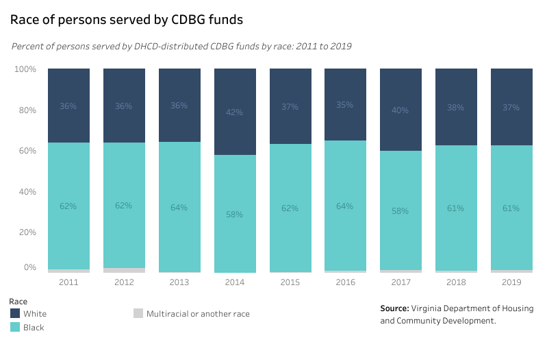
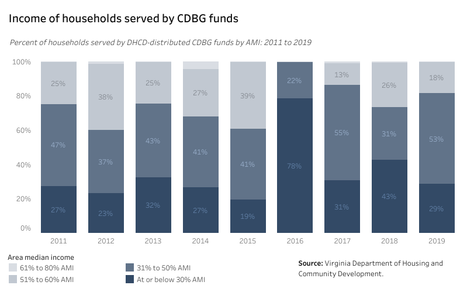
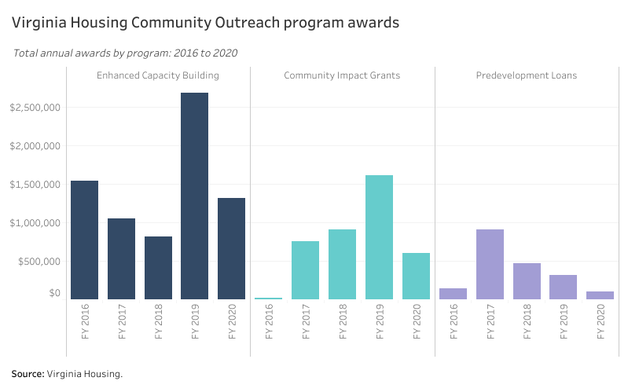

# Community revitalization and capacity building {#part-4-revitalization}

:::{.open data-latex=""}
This chapter covers five programs created to support major community revitalization efforts through housing and to strengthen the capacity of nonprofit housing organizations across the state.
:::

## Highlights {.unlisted .unnumbered}

Major takeaways in this chapter include:

* Using both federal and state dollars, a suite of community revitalization and capacity building programs foster creative approaches to meet the unique housing needs of Virginia’s diverse communities.
* Capacity building programs, especially those offered by Virginia Housing, strengthen affordable housing providers and make them resilient to future challenges.
* Opportunities for improvement are primarily administrative: these include better alignment of applications and project timelines, technical assistance, ease of entry, and streamlining the closing process.
* Expanding the successful Vibrant Community Initiative, aligning state revitalization efforts with local public housing revitalization goals, encouraging more inclusive land use strategies, and greater involvement of BIPOC developers and contractors are all ways to enhance these programs.

## Programs in this grouping {.unlisted .unnumbered}

*Click each program name for a PDF fact sheet.*

**Virginia Housing**

* [Capacity Building Grants](pdf/vh-capbuild.pdf)
* [Community Impact Grants (CIG)](pdf/vh-cig.pdf)
* [Predevelopment Loan Program (PDL)](pdf/vh-pdl.pdf)

**Department of Housing and Community Development**

* [Community Development Block Grant (CDBG)](pdf/dhcd-cdbg.pdf)
* [Vibrant Communities Initiative (VCI)](pdf/dhcd-vci.pdf)

## Findings 

:::{.open data-latex=""}
These findings are based on data provided by Virginia Housing, DHCD, and other sources on the scale of these programs, demographic information on their beneficiaries, and other trends.
:::

### Finding 1 {.unlisted .unnumbered}

##### Virginia’s Community Development Block Grant (CDBG) allocation significantly helps ELI and VLI households of color in non-entitlement communities. {.unlisted .unnumbered}

```{r prog-revit-01, fig.cap="Race of persons served by CDBG funds"} 
if (knitr::is_html_output()) {
knitr::include_url(url =
"https://public.tableau.com/views/HB854-AnalysisofExistingPrograms-CDBGbyrace/cdbg_race_db?:showVizHome=no&:embed=true", height = "500px")
} else {}
```

Across non-metro areas of the Commonwealth, DHCD’s CDBG funds used for housing-related activities are more likely to serve Black Virginians than any other race.

```{r prog-revit-02, fig.cap="Income of households served by CDBG funds"} 
if (knitr::is_html_output()) {
knitr::include_url(url =
"https://public.tableau.com/views/HB854-AnalysisofExistingPrograms-CDBGbyincome/cdbg_ami_db?:showVizHome=no&:embed=true", height = "500px")
} else {}
```

Federal CDBG dollars are restricted to 80 percent AMI and below, so all funds benefit households with low incomes. However, DHCD’s CDBG funds are used primarily to serve VLI households (those below 50 percent AMI) and ELI households (those below 30 percent AMI).

### Finding 2 {.unlisted .unnumbered}

##### Since 2016, Virginia Housing has awarded over $13 million in grants and loans to support affordable housing providers in Virginia. {.unlisted .unnumbered}

```{r prog-revit-03, fig.cap="Virginia Housing Community Outreach program awards"} 
if (knitr::is_html_output()) {
knitr::include_url(url =
"https://public.tableau.com/views/HB854-AnalysisofExistingPrograms-VirginiaHousingCommunityOutreachPrograms/Dashboard11?:showVizHome=no&:embed=true", height = "500px")
} else {}
```

Virginia Housing helps build the capacity of affordable housing providers across the state by offering Predevelopment Loans, Community Impact Grants, and organizational Enhanced Capacity Building grants. These community outreach programs each serve a unique purpose and supplement more traditional forms of federal and state funding.

## Program successes

:::{.open data-latex=""}
These successes are based on feedback collected from the statewide provider survey, focus groups, and conversations with experienced users of these programs.
:::

### Success 1 {.unlisted .unnumbered}

##### The Vibrant Communities Initiative (VCI) supports transformational projects. {.unlisted .unnumbered}

Stakeholders expressed positive views of VCI as a model of how the state can facilitate projects that result in change at a significant scale. These projects can catalyze long term neighborhood improvement by encouraging similar successful efforts on nearby sites.

VCI also demonstrates the value that the state can bring to a problem by combining resources on the front end, rather than leaving it to the developers to shop for them one at a time. 

### Success 2 {.unlisted .unnumbered}

##### Virginia Housing’s Community Impact Grant (CIG) has been well received as a flexible tool that works across many different regions of the state to accomplish different objectives. {.unlisted .unnumbered}

Stakeholders value the CIG program particularly for its flexibility that allows for its wide application supporting a variety of projects. Stakeholders appreciate the program’s support for innovations such as manufactured housing and other construction strategies. The CIGs also have financed a broad array of creative approaches to help communities strategically address their unique affordable housing challenges. 

### Success 3 {.unlisted .unnumbered}

##### CDBG funds can be game-changing for rural communities.{.unlisted .unnumbered}

Funding for community development projects in rural areas is not widely available. The non-entitlement CDBG program is unique in the scale of grant funding that it can bring to the table. Stakeholders saw it as an excellent tool for offsetting site development and utility extensions for rural projects---which have costs that often render a project infeasible. 

### Success 4 {.unlisted .unnumbered}

##### Virginia Housing and DHCD recognize that outreach to localities is important. They understand the value of this engagement and dedicate staff time to it. {.unlisted .unnumbered}

Local governments are critical partners in the development of affordable housing for numerous reasons. They control land use, manage community expectations, provide access to utilities, and provide resources in the form of financial assistance and processing incentives. However, these communities need help in developing project concepts and understanding what type of state assistance is accessible. 

Stakeholders were extremely complimentary of the staff time and resources dedicated by both state housing agencies to community outreach and assistance. 

### Success 5 {.unlisted .unnumbered}

##### Capacity Building grants are helping many organizations with diverse needs, especially strategic planning and capacity building at smaller nonprofits. {.unlisted .unnumbered}

As resources for affordable housing increase, affordable housing sponsors face the fundamental challenge of bolstering their own capacity to deliver services. Stakeholders enthusiastically recognized Virginia Housing and DHCD for their commitment to capacity building through organizational support, project planning, and pre-development assistance. 

## Program challenges

:::{.open data-latex=""}
These challenges are based on feedback collected from the statewide provider survey, focus groups, and conversations with experienced users of these programs.
:::

### Challenge 1 {.unlisted .unnumbered}

##### There is a need to provide technical assistance to projects that are at the conceptual stage prior to application for major funding like the VCI. {.unlisted .unnumbered}

Stakeholders recommend that housing agencies sustain and increase support and advisory services to localities and developers who are working to assemble large scale, complex projects requiring funding within the next year. Shepherding these projects on a path toward feasibility is a priority, especially in an environment where the resources essential to project success are only expected to rise. 

### Challenge 2 {.unlisted .unnumbered}

##### Stakeholders new to housing projects need a more navigable, well-defined initial process for bringing projects to Virginia Housing and DHCD. {.unlisted .unnumbered}

Some local stakeholders indicated difficulty in determining where to find information and which staff person to contact depending on the project they are planning. Other stakeholders suggested a more clearly defined entry point for technical assistance and support, especially for localities whose employees may be less familiar with state housing agency staff and organizational structure. 

### Challenge 3 {.unlisted .unnumbered}

##### The Predevelopment Loan Program closing process can be too complex; limited project eligibility can lock out otherwise worthy applicants. {.unlisted .unnumbered}

Several stakeholders noted that the Predevelopment Loan Program is time consuming and its approval process lacks clarity. The closing process can be too complicated for the size of the transactions. There is a natural balance between the need for flexible predevelopment support and the lender’s need for repayment; a reevaluation of this balance could lead to a retooled model that is easier to use and more successful.    

The design of the Predevelopment Loan Program should be revisited in consultation with housing developers---especially nonprofits and small for-profits.

### Challenge 4 {.unlisted .unnumbered}

##### Some perceive the Capacity Building Grant sphere as too complex or over-prescribed. {.unlisted .unnumbered}

Over the last five years, Virginia Housing has developed a capacity building initiative aimed at helping nonprofit organizations grow their ability to be successful developers and administrators of affordable housing. Its wide use by the nonprofit community underscores the need for it. The nonprofit sector’s growth in capacity may certainly be credited, at least in part, to the array of assistance the program has provided.

In the last several years, the capacity building initiative has added a number of new funding tiers. Some stakeholders expressed concern that the flexibility that characterized the earlier program  is becoming more rigid. They emphasized the widely differing circumstances of providers and suggested a return to more of a negotiated technical support package. 

### Challenge 5 {.unlisted .unnumbered}

##### Knowledge and usage of the Vibrant Communities Initiative (VCI) is low in non-entitlement areas. {.unlisted .unnumbered}

The VCI can be an important resource for smaller communities in rural areas. There is a need for more communication about VCI with these communities where VCI is not widely understood as in larger metro areas. These smaller communities are also likely to need greater assistance with project planning and development. 

### Challenge 6 {.unlisted .unnumbered}

##### Funds within this cluster are less commonly used for single-family homeownership programs. They are predominately used for major multifamily and mixed-use projects. {.unlisted .unnumbered}

Stakeholders appreciated the transformative nature of many of these larger mixed-use developments that frequently include a diverse rental housing component. Given the importance of creating homeownership opportunities, especially for BIPOC participants, stakeholders agreed that projects with homeownership components should be encouraged. A new source of assistance focused on homeownership would also enhance the current mix of resources. 

### Challenge 7 {.unlisted .unnumbered}

##### Timing of program availability and applications can sometimes be challenging, especially when projects also use federal funds. {.unlisted .unnumbered}

Projects that employ federal funds are complex, and they inevitably include a wide range of resources in building the layered funding structure. When resources come from federal, state, and private sources, developers and localities face challenges with application schedules and project timing that complicate the process of fully funding the project. 

## Recommendations

:::{.open data-latex=""}
These recommendations synthesize the findings, successes, and challenges identified for this cluster of programs. They offer a roadmap to a future where these state initiatives are efficient, impactful, and best serve Virginians who need greater housing opportunities.
:::

### Recommendation 1 {.unlisted .unnumbered}

##### Establish a VCI planning grant or similar funds to support smart, strategic planning efforts for large-scale projects in their infancy. {.unlisted .unnumbered}

**Why this is needed**

* Stakeholders strongly supported this initiative primarily because these projects are high impact, and the state has innovatively assembled a variety of resources in one location, so the developer does not need to navigate multiple access points. Agencies should develop and deploy a planning grant specific to VCI to increase and improve applications. This would also help put smaller jurisdictions on a more competitive footing with larger, more experienced teams. 
* The planning grant program widely used with CDBG for many years may be an applicable prototype. HUD also deploys planning grants to localities and PHAs that are seeking funding under the Choice Neighborhoods Initiative; a similar state option would helpfully supplement those efforts in communities with public housing.
* Virginia Housing recently made awards to planning district commissions (PDCs) in the state with the purpose of encouraging them to develop stronger relationships with affordable housing providers.^["[Virginia Housing Announces $40 Million in Grant Funding for PDCs.](https://www.vhda.com/about/NewsCenter/Pages/PDC-Partnership-July132021.pdf)" Virginia Housing. July 13, 2021. (PDF)] If this effort proves successful, PDCs might also be helpful planning partners for future VCI proposals. 

**Who is responsible:**

* Virginia Housing
* Department of Housing and Community Development
* Planning district commissions
* Localities

**How to accomplish:**

Virginia Housing and DHCD should allocate funds to the VCI for project planning using the earlier cited models. Depending on project scale, these grants could run from 12 to 24 months with prescribed deliverables included in the VCI application. A scoring incentive for planning grant recipients could encourage organizations to use the grant to shape more realistic and feasible proposals. Virginia Housing could position its CIG program to be used more frequently to support the development of VCI applications.

### Recommendation 2 {.unlisted .unnumbered}

##### Design a "central intake" for localities or developers when they have an affordable housing project proposal---whether complex like VCI, simple as with a single development, or for innovations in systems and construction methods. {.unlisted .unnumbered}

**Why this is needed:**

* Stakeholders report that rural (non-entitlement) areas have less knowledge about state housing agency programs and fewer relevant staff positions. 
* A clearer path with guidance on appropriate contacts for specific issues would foster a more level playing field for potential applicants.
* Program staff are extremely knowledgeable and helpful. Providing more direct access to them for more developers would benefit the program. 

**Who is responsible:**

* Virginia Housing
* Department of Housing and Community Development
* Localities
* Virginia Municipal League (VML), Virginia First Cities, and Virginia Association of Counties (VACO)

**How to accomplish:**

DHCD and Virginia Housing should work with local governments and their associations to determine preferred processes and needs for localities. This assessment would then inform a collaboration with localities, trade associations, local developers, and program administrators to craft an intake process for technical assistance and support more accessible for those unfamiliar with the programs and new to affordable housing development.  

### Recommendation 3 {.unlisted .unnumbered}

##### To expand the use of pre-development loans, Virginia Housing should consider design changes to increase flexibility in program guidelines, timelines, closing process and reporting. {.unlisted .unnumbered}

**Why this is needed:**

* Some stakeholders noted that the current Predevelopment Loan Program would be more widely used if it had greater flexibility and offered a more timely, less complicated processing and closing experience. The purpose of the predevelopment assistance is to allow a more thinly capitalized developer to expend the funds needed to assemble a viable project application in a timely and efficient manner. 
* Architecture, legal, appraisal, and engineering are the types of expenses that must be paid at the front end of the development process---often before the fate of the application is determined.
* The challenge with any predevelopment loan program is balancing loan risk with the need to fund activities before feasibility is established. 

**Who is responsible:**

* Virginia Housing
* Program users, especially smaller nonprofit and for-profit developers

**How to accomplish:**

Virginia Housing should engage program users to determine if there are design shifts that will make the program more user friendly. This should include an assessment of whether a change in the funding source---such as HUD’s Housing Trust Fund---would facilitate greater flexibility.

### Recommendation 4 {.unlisted .unnumbered}

##### Continue and expand efforts to encourage and fund more VCI projects in non-entitlement areas. {.unlisted .unnumbered}

**Why this is needed:**

* VCI projects have tended to be large scale and complex. Urban areas are more likely to have the potential to identify and develop these types of projects that may have multiple objectives and a range of participants and funding sources. 
* While non-entitlement area projects are likely to be smaller, they also can be transformative for their neighborhoods. These areas will likely need more assistance from the state in developing projects that will be able to compete with those that are assembled by the more experienced teams in metro areas. 

**Who is responsible:**

* Virginia Housing
* Department of Housing and Community Development
* Small (non-entitlement) localities
* Virginia Municipal League (VML) and Virginia Association of Counties (VACO)

**How to accomplish:**

Virginia Housing and DHCD should expand outreach and education about VCI using networks that connect with smaller communities (e.g., Rural Planning Caucus of Virginia). The agencies should also build stronger technical assistance functions specifically for smaller communities and consider an emphasis on planning grants for rural communities seeking assistance with a project. 

### Recommendation 5 {.unlisted .unnumbered}

##### Allow VCI awards to be used over multiple years to help large, complex projects, especially those relying on other major sources of funding. {.unlisted .unnumbered}

**Why this is needed:**

* VCI encourages large scale, complex projects that can have a transformational impact on their communities. Often these projects take many years to achieve. Projects may have two or more phases that are crucial to a successful outcome. VCI awards that span the full timeframe of the project may enhance such efforts. 
* Multiple year funding from VCI may enable program participants to leverage additional outside funding and potentially secure multi-year commitments from other sources.

**Who is responsible:**

* Virginia Housing
* Department of Housing and Community Development
* Public and private VCI funders

**How to accomplish:**

Virginia Housing and DHCD should review VCI applications for the past several years, interview the teams that developed them, and assess how multi-year financing would have affected the project and influenced other funding sources. The agencies should then convene other VCI funders to discuss approaches to longer term commitments to multiple year projects. These may include multi-year funding that is based upon the achievement of milestones within prescribed timeframes. Such incentives could motivate and add urgency to project development. 

### Recommendation 6 {.unlisted .unnumbered}

##### Expand and encourage use of programs (particularly VCI and CIG) for homeownership, especially as a tool to support wealth-building in historically Black neighborhoods. {.unlisted .unnumbered}

**Why this is needed:**

* Most VCI work focuses on mixed-use, mixed-income projects where rental housing is the key residential component of the project. In recent years, an overheated homeownership market---especially in larger metro areas---has left behind lower-income potential homebuyers as the market has served primarily middle- and upper-income buyers. 
* The homeownership gap between Black and white households has grown over the last decade. 
* VCI applications should incentivize mixed income homeownership. They should also encourage neighborhood revitalization with increased homeownership as an anchor activity. 

**Who is responsible:**

* Virginia Housing
* Department of Housing and Community Development
* Localities
* Other local funders

**How to accomplish:**

DHCD and Virginia Housing could adapt programs to facilitate rapid acquisition of properties and/or large down payments, potentially with revolving loan funds. The agencies should develop best practice standards and examples of redevelopment and revitalization projects that prioritize affordable homeownership.

VCI training and education should include more examples of homeownership, and each funding cycle should include some homeownership proposals. Scoring incentives for local land donations for homeownership would accelerate these projects.

### Recommendation 7 {.unlisted .unnumbered}

##### Consider LIHTC set-asides for VCI and similar projects to ensure assets are leveraged and to simplify layering and timing challenges. {.unlisted .unnumbered}

**Why this is needed:**

* LIHTCs are one of the most competitive funding sources for affordable housing in the nation. Competition for LIHTCs is high and assembling and submitting an LIHTC application is costly. 
* A set-aside of credits for high-ranking VCI applications simplify the VCI process and make it more likely that projects will be successfully funded in a timely manner.

**Who is responsible:**

* Virginia Housing 

**How to accomplish:**

Virginia Housing should seek feedback during the next QAP comment period to determine support for linking LIHTCs to the VCI process. 

### Recommendation 8 {.unlisted .unnumbered}

##### Coordinate with the Virginia Association of Housing and Community Development Officials to align state efforts for public housing revitalization with the programs in this cluster. {.unlisted .unnumbered} 

**Why this is needed:**

* The replacement or revitalization of large, aging public housing communities is one of the most pressing problems in the Commonwealth. Residents often endure poor living conditions that are especially detrimental to the health and well-being of the many children who grow up in these communities and who are at a significant disadvantage compared to their peers in higher quality, better located housing.
* HUD is supporting the transformation of public housing and shifting the funding platform to the more reliable Section 8 mechanism through the Rental Assistance Demonstration program (RAD) and through Section 18 - Demolitions/Dispositions. 
* Replacement and revitalization of public housing is quantifiable and achievable. The oldest and worst public housing in the state are the large projects built in the 1970s and earlier. Many of them have already been revitalized and replaced, but a significant number remain---just under 10,000 units scattered across Virginia’s large metro areas. A concentrated effort could replace and rehabilitate them within a decade---bringing an end to this legacy from an earlier era of federal housing policy. 

**Who is responsible:**

* Virginia Housing
* Department of Housing and Community Development
* Virginia Association of Housing and Community Development Officials (VAHCDO)
* Public housing authorities (PHAs)
* Localities

**How to accomplish:**

Public housing revitalization is a complex and expensive undertaking. The revitalization programs that make up this cluster are well positioned to aid this process. Virginia Housing has already prioritized this work through the PHA pool in the LIHTC program as well as a set-aside of REACH funding for these types of projects.

Building on this base, state housing agencies should engage directly with localities and PHAs and seek ways in which this suite of state programs can support existing public housing revitalization plans as well as assist in developing new plans where needed. 

### Recommendation 9 {.unlisted .unnumbered}

##### State government should work with localities to remove land use barriers and encourage more inclusive land use strategies. {.unlisted .unnumbered}

**Why this is needed:**

* Land use policies, including zoning, have been frequently identified by stakeholders as one of the key barriers to production of affordable housing in many communities. 

**Who is responsible:**

* State government
* Localities
* Other applicants for community revitalization funds

**How to accomplish:**

State government officials should begin a dialogue with localities seeking funding for community revitalization to understand their land use policies and whether they encourage or inhibit affordable housing development. Agencies could create a menu of best practices in land use policies that are inclusionary and help support projects supported by these programs. New incentives in the review and scoring of VCI and other revitalization funding could also encourage local adoption of policies that facilitate affordability.

### Recommendation 10 {.unlisted .unnumbered}

##### Recruit higher participation by minority developers and contractors. {.unlisted .unnumbered}

**Why this is needed:**

* The BIPOC community is underrepresented in the housing development industry, paralleling the lag between Black and Brown households and white households for access to high quality, affordable housing.
* Change in who is developing, building, managing, and selling housing will occur only with intentional efforts.
* Capacity building and technical support efforts to date have not been effective in substantially increasing minority participation in the industry. 

**Who is responsible:**

* Virginia Housing
* Department of Housing and Community Development
* Home Builders Association of Virginia
* Virginia REALTORS®
* Urban Land Institute and other industry leaders

**How to accomplish:**

DHCD and Virginia Housing should apply scoring incentives to proposals submitted by organizations with BIPOC leadership and/or proposals which demonstrate a measurable commitment to racial equity.

The agencies should also focus on minority developers and community development corporations for capacity building, offer robust technical assistance and funding over a sustained period, and foster partnerships with experienced developers.

Additional objectives include:

* Expansion and increased funding of current initiatives to grow minority participation in the industry,
* Establishment of goals in conjunction with developers, builders, lenders, housing authorities, nonprofits, real estate agents, and others, and
* Annual progress reports to measure improvement.
