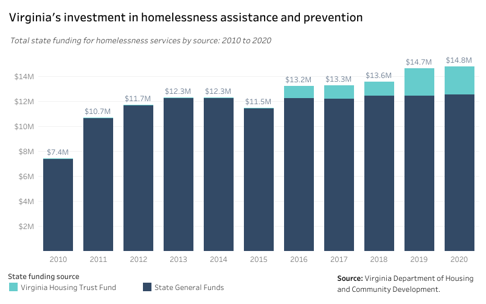
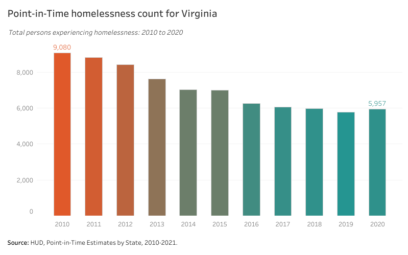
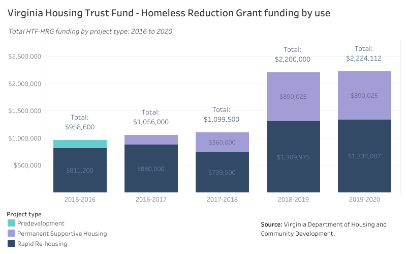

# Homelessness assistance and prevention {#part-4-homelessness}

:::{.open data-latex=""}
This chapter covers six programs that support efforts to assist persons experiencing homelessness and to build infrastructure to make homelessness rare, brief, and non-recurring.
:::

## Highlights {.unlisted .unnumbered}

Major takeaways in this chapter include:

* Virginia’s stable and increasing investments in the Virginia Homelessness Solutions Program and the Housing Trust Fund - Homeless Reduction Grant have yielded clearly measurable successes, as Point-in-Time counts of those experiencing homelessness have steadily declined over the past decade.
* The overall supply of housing available for persons transitioning out of homelessness is inadequate and is now a programmatic priority. Community resistance, financing limitations, and land use restrictions all impede more permanent solutions to end homelessness.
* To make lasting progress, state efforts should focus on increasing the supply of deeply affordable housing, expanding long-term rental assistance options, increasing inter-agency collaboration, and better integrating housing services in criminal processing and educational systems.

## Programs in this grouping {.unlisted .unnumbered}

*Click each program name for a PDF fact sheet.*

**Department of Housing and Community Development**

* [Affordable and Special Needs Housing (ASNH)](pdf/dhcd-asnh.pdf)
* [Housing Opportunities for Persons with AIDS/HIV (HOPWA)](pdf/dhcd-hopwa.pdf)
* [Virginia Homelessness Solutions Program (VHSP)](pdf/dhcd-vhsp.pdf)
* [Virginia Housing Trust Fund - Homeless Reduction Grant (HTF-HRG)](pdf/dhcd-htfhrg.pdf)

**Department of Behavioral Health and Developmental Services**

* [Permanent Supportive Housing - Serious Mental Illness (PSH-SMI)](pdf/dbhds-psh.pdf)
* [State Rental Assistance Program (SRAP)](pdf/dbhds-srap.pdf)

## Findings

:::{.open data-latex=""}
These findings are based on data provided by Virginia Housing, DHCD, and other sources on the scale of these programs, demographic information on their beneficiaries, and other trends.
:::

### Finding 1 {.unlisted .unnumbered}

##### Virginia has continued to increase its investments in programs to end homelessness. {.unlisted .unnumbered}

```{r prog-prev-01, fig.cap="Virginia's investment in homelessness assistance and prevention"} 
if (knitr::is_html_output()) {
knitr::include_url(url =
"https://public.tableau.com/views/HB854-AnalysisofExistingPrograms-Homelessnessfunding/va_homelessness_db?:showVizHome=no&:embed=true", height = "500px")
} else {}
```

In 2020, the Commonwealth invested nearly $15 million in its two major homelessness prevention programs: the Virginia Homelessness Solutions Program and the Housing Trust Fund - Homeless Reduction Grant. 

While the state’s General Fund allocation to VHSP has remained steady in recent years, the most significant increases have occurred in the amount of Virginia Housing Trust Fund dollars in support of HTF-HRG.

### Finding 2 {.unlisted .unnumbered}

##### Virginia’s investments have resulted in significant decreases in the number of persons experiencing homelessness. {.unlisted .unnumbered}

```{r prog-prev-02, fig.cap="Point-in-Time homelessness count for Virginia"} 
if (knitr::is_html_output()) {
knitr::include_url(url =
"https://public.tableau.com/views/HB854-HousingInstabilityandHomelesness-Point-in-TimecountforVirginia/pit_db?:showVizHome=no&:embed=true", height = "500px")
} else {}
```

Coordination by DHCD and local Continuums of Care (CoC) has significantly decreased the number of observed persons experiencing homelessness in Virginia. Point-in-Time (PIT) counts have decreased 34 percent from just over 9,000 homeless individuals in 2010 to fewer than 6,000 in 2020.

### Finding 3 {.unlisted .unnumbered}

##### Funding for permanent supportive housing under the Homeless Reduction Grant has increased significantly since the 2017-2018 program year. {.unlisted .unnumbered}

```{r prog-prev-03, fig.cap="Virginia Housing Trust Fund - Homeless Reduction Grant funding by use"} 
if (knitr::is_html_output()) {
knitr::include_url(url =
"https://public.tableau.com/views/HB854-AnalysisofExistingPrograms-VirginiaHTF-HRG/tot_award_year_type_db?:showVizHome=no&:embed=true", height = "500px")
} else {}
```

In the 2018-2019 program year, DHCD awarded funding to 13 permanent supportive housing (PSH) projects. This award was a major increase from the previous year where DHCD awarded $360,000 across five projects. This pivot represents a significant investment in permanent solutions to end homelessness.

## Program successes

:::{.open data-latex=""}
These successes are based on feedback collected from the statewide provider survey, focus groups, and conversations with experienced users of these programs.
:::

### Success 1 {.unlisted .unnumbered}

##### Virginia’s increasing commitment to end homelessness is noteworthy. {.unlisted .unnumbered}

Virginia’s commitments to homelessness prevention over the past decade are impressive and worth highlighting. State government now plays a lead role in reducing homelessness throughout the Commonwealth and commits historic levels of funding to address these challenges.

### Success 2 {.unlisted .unnumbered}

##### Homelessness prevention programs are well-coordinated in Virginia. {.unlisted .unnumbered}

Virginia’s strong collaboration by state and local providers includes coordinating a variety of federal resources. For instance, the VHSP application is modeled on the federal process, which reduces obstacles and allows for strategic investments. Funding can cover dedicated staff and critical administrative and data needs.

### Success 3 {.unlisted .unnumbered}

##### The HTF-HRG reimbursement process has worked well during the program’s lifespan. {.unlisted .unnumbered}

Stakeholders and program administrators report that once HTF-HRG funds have been awarded, the reimbursement process runs smoothly. Funds also can cover supportive services and administrative staffing costs, which are not always covered by funding sources, but are much needed.

## Program challenges

:::{.open data-latex=""}
These challenges are based on feedback collected from the statewide provider survey, focus groups, and conversations with experienced users of these programs.
:::

### Challenge 1 {.unlisted .unnumbered}

##### Expanding the supply and spectrum of housing options has become a greater priority, and requires more support. {.unlisted .unnumbered}

Increased funding levels have been pivotal to decreasing the number of persons experiencing homelessness, and funding---if current levels are sustained---is now less of a problem than it was a decade ago. The current pressing issue is the challenge of expanding the full spectrum of available housing options to meet the needs of those experiencing homelessness. 

The supply of housing affordable and attainable to persons exiting homelessness is extremely limited. This includes both income-restricted housing and privately owned market-rate housing. Additionally, there are few state-supported incentives for private landlords to lease to tenants exiting homelessness, forcing providers to use privately-raised dollars instead.

The majority of persons exiting homelessness do not need a full suite of PSH offerings. There is a need to explore other models, such as single room occupancy (SRO) units and similar units with shared common spaces. However, local land use policies are often a major barrier to this.

### Challenge 2 {.unlisted .unnumbered}

##### Despite increased collaboration, the homelessness system still has some components that are siloed. {.unlisted .unnumbered}

Although state agencies, the Continuum of Care (CoC) program, and other providers collaborate effectively, there are still major opportunities for homelessness programs to integrate more fully into the broader housing and service delivery sectors. One example is the need for the PSH-SMI program to increase collaboration with CoCs.

Homelessness providers often deal with the downstream effects of challenges that emerge in the criminal processing and education systems. Although providers understand these connections, legislators and policymakers need to be better informed and more aware of the need for structural reform to end the root causes of housing instability.

### Challenge 3 {.unlisted .unnumbered}

##### Some program design aspects hinder homeless service provider effectiveness. {.unlisted .unnumbered}

Providers noted that programs operating on a reimbursement basis are challenging for homelessness providers who have large-scale costs like property acquisitions and hotel reimbursements. 

As acquisition and construction costs rise, limits on project capital for some programs are becoming an issue. Providers would like to see these capital limits raised to reduce the need for additional funding sources for capital costs.

### Challenge 4 {.unlisted .unnumbered}

##### NIMBYism at the local level can delay or derail efforts to combat homelessness. {.unlisted .unnumbered}

"Not in my backyard" sentiments are most often expressed by members of the general public, but are also endemic in local officials when there is a vacuum of information. According to many providers, city and county managers are often unaware of how CoCs and associated homelessness prevention and assistance efforts actually work.

### Challenge 5 {.unlisted .unnumbered}

##### Financing and overly restrictive local land use policies increase the barriers to providers. {.unlisted .unnumbered}

Many projects aimed at reducing homelessness face challenges due to funding or financing and local land use regulations. These barriers increase the obstructions service providers confront in attempting to address homelessness in their communities.

## Recommendations

:::{.open data-latex=""}
These recommendations synthesize the findings, successes, and challenges identified for this cluster of programs. They offer a roadmap to a future where these state initiatives are efficient, impactful, and best serve Virginians who need greater housing opportunities.
:::

### Recommendation 1 {.unlisted .unnumbered}

##### Virginia’s support to end homelessness should expand permanent solutions by increasing the supply of deeply affordable housing and expanding long-term rental assistance options. {.unlisted .unnumbered}

**Why this is needed:**

The number and variety of deeply affordable housing units for persons exiting homelessness remains low. Service providers struggle to find units that not only meet the needs of their clients but are also priced affordably. These supply issues are stalling efforts to end homelessness.

**Who is responsible:**

* Department of Housing and Community Development
* Virginia Housing
* Department of Behavioral Health and Developmental Services
* Virginia Department of Social Services
* General Assembly
* Governor 

**How to accomplish:**

DHCD should use increases in the HTF to sustain and expand its deployment of HRG funds for investments in permanent supportive housing. The state should encourage localities to amend local land use policies to allow for different types of housing that support persons experiencing homelessness.

### Recommendation 2 {.unlisted .unnumbered}

##### When possible, allow for more flexibility in the expenditure of homelessness funds following COVID-19. {.unlisted .unnumbered}

**Why this is needed:**

* Service providers often cited overly restrictive funds as a major barrier to addressing the needs of their clients and stably housing persons experiencing or exiting homelessness. This often resulted from federal funding rules that require changes in HUD programs, which DHCD is then responsible for administering.
* Providers also cited a lack of sufficient funding for supportive services often necessary to help address homelessness and transition clients into stable housing.
* Although the abundance of homelessness-related funding allocated during the COVID-19 pandemic alleviated some of these restrictions and gave providers additional flexibility, pandemic-related funding increases are not likely to stay permanent.

**Who is responsible:**

* Department of Housing and Community Development

**How to accomplish:**

DHCD should allow homeless service providers to use awarded funds on other services and resources that meet additional needs of individuals experiencing homelessness, unless DHCD is constrained by federal requirements.

For example, incentives to landlords to rent to people exiting homelessness are an eligible expense for Emergency Services Grant-CARES Act (ESG-CV) funds under the Virginia COVID Homelessness Emergency Response Program. This use should be codified permanently and not be limited to pandemic emergency response.  

### Recommendation 3 {.unlisted .unnumbered}

##### Expand existing education and professional development networks to include local officials, community service boards, and other social service providers. {.unlisted .unnumbered}

**Why this is needed:**

* Stakeholders outside of the homelessness system are not well informed about how homelessness assistance and prevention programs work and the people the programs serve.

**Who is responsible:**

* Local government officials (e.g., city councils, boards of supervisors, and county administrators)
* Local community service boards
* Local departments of social services
* Department of Behavioral Health and Developmental Services
* Virginia Department of Social Services
* Managed care organizations (MCO)
* Virginia Housing Alliance and advocates
* Department of Housing and Community Development

**How to accomplish:**

Virginia should support and incentivize the inclusion of non-traditional stakeholders in professional development, education, and networking events held by groups like Virginia Housing Alliance. This can be done through greater promotion of these events and opportunities through housing and social services networks.

### Recommendation 4 {.unlisted .unnumbered}

##### Integrate housing services in criminal processing and educational systems more comprehensively to strengthen homelessness assistance and prevention efforts. {.unlisted .unnumbered}

**Why this is needed:**

* Prevention of homelessness can be more successful in upstream systems where at-risk individuals and families are first identified. 
* Early identification and prevention in criminal processing, foster care,  and educational systems can lessen pressures on CoCs and more effectively address homelessness among justice-involved populations and students at risk of or currently experiencing homelessness.

**Who is responsible:**

* Department of Housing and Community Development
* Department of Criminal Justice Services (VDCJS)
* Virginia Department of Education (VDOE)
* Department of Behavioral Health and Developmental Services
* Virginia Department of Social Services
* Continuums of Care and Local Planning Groups (LPG)
* Governor

**How to accomplish:**

Frontline agencies---DHCD, DBHDS, DCJS, VDOE, and other stakeholders--- should establish and foster regular inter-agency communication and develop solutions to common challenges of housing vulnerable populations. This should involve identifying opportunities to better integrate housing services in educational systems and improve discharge planning in criminal processing systems to strengthen homelessness prevention. 

### Recommendation 5 {.unlisted .unnumbered}

##### Shift grant programs away from reimbursement models to facilitate faster delivery of funds and more sustainable cash flows for providers. {.unlisted .unnumbered}

**Why this is needed:**

* The current reimbursement process through HTF-HRG requires homeless service providers to cover carrying costs before being reimbursed. This can create instability in nonprofit balance sheets, especially for those that depend heavily on government resources.

**Who is responsible:**

* Department of Housing and Community Development

**How to accomplish:**

DHCD should transition from reimbursement models to facilitate faster delivery of funds and more sustainable cash flows for providers. DHCD should also reduce or eliminate interest charged on borrowed money to cover services prior to reimbursement. Alternatively, they could explore whether interest can be reimbursed as an allowable administrative cost.