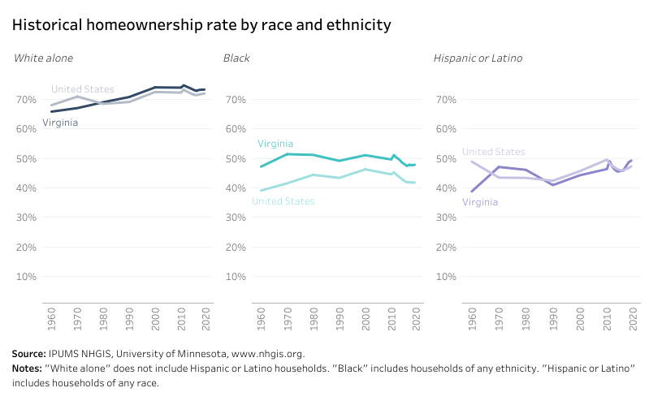
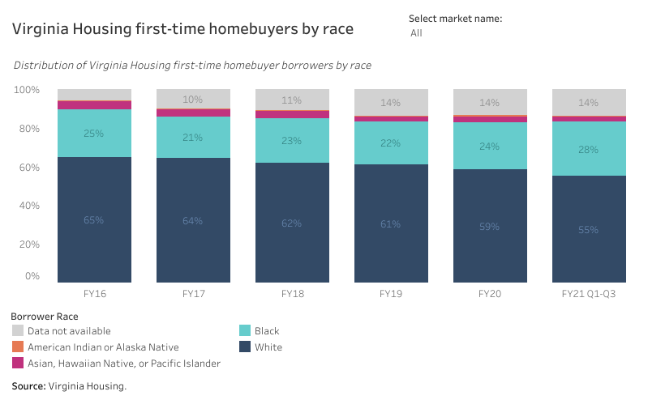
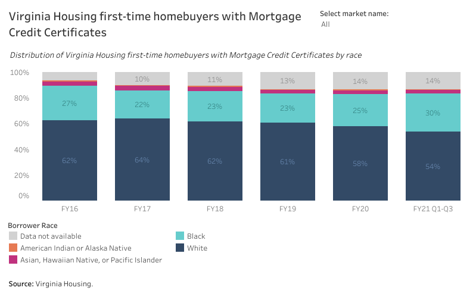
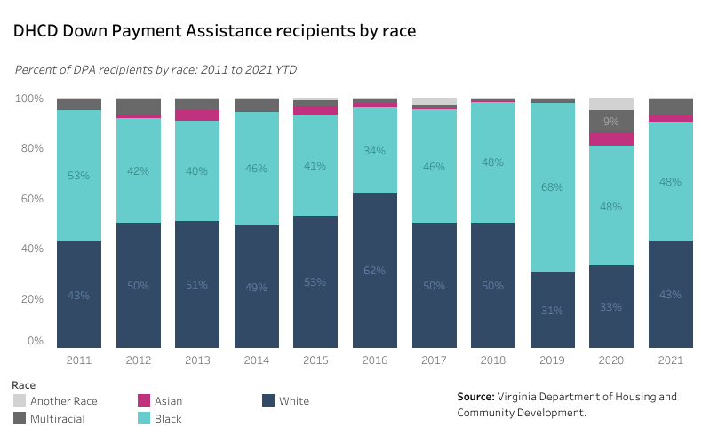

# Addressing racial equity in housing across Virginia {#part-5-racialequity}

::: {.open data-latex=""}
This chapter provides recommendations to policymakers for reducing racial disparities in housing. While not specifically referenced in the text of HB854, the steering committee and Stakeholder Advisory Group unanimously agreed that the report should include this topic.
:::

## Highlights {.unnumbered .unlisted}

Major takeaways in this chapter include:

* While better than the national average, Virginia has a wide gap in homeownership rates that leaves Black households 25 points behind white households.
* Historical patterns of discrimination also produce inequities in wealth and well-being for Black households: they are more likely to be cost-burdened, to live in poor quality housing, to lose their housing, or to have few options of where to live.
* Racial inequity exists on both sides of the housing equation: ownership of production and development companies and leadership of nonprofits are predominantly white.
* Both Virginia Housing and the Department of Housing and Community Development have expanded programs and efforts to advance fair housing goals, including improving access to homeownership for Black Virginians.
* Continued efforts to address racial equity in housing will require Black and brown-led long-term engagement, as well as continued statewide leadership.
* Strategies to address these racial disparities in housing seek to expand Black access to homeownership, help mitigate the effects of gentrification, increase success and choice in rental assistance programs, and ensure that equity is considered at all levels of the housing industry.

## The current landscape

### Why we must act

While the language in HB854 does not specifically address the issue of racial disparities in housing, the SAG agreed that the study should incorporate an analysis of racial equity in housing and that every work group should include it in their issue area discussion.

Racial disparities in housing are as widespread throughout Virginia as they are nationally. The legacy of slavery and 150 years of public policy and private discrimination have left Virginians who are Black or African American and other persons of color disadvantaged with respect to housing conditions and status.

The history of [redlining](https://dsl.richmond.edu/panorama/redlining/#loc=5/39.1/-94.58&text=intro) and race-based federal mortgage programs, [deed restrictions](https://www.cnn.com/2020/02/15/us/racist-deeds-covenants/index.html) based on race, [predatory lending programs](https://www.reuters.com/article/us-usa-foreclosures-race/racial-predatory-loans-fueled-u-s-housing-crisis-study-idUSTRE6930K520101004), and [discriminatory property appraisals](https://www.marketplace.org/2021/08/09/when-it-comes-to-the-racial-wealth-gap-home-appraisals-are-part-of-the-problem/) contribute to many inequities that the Commonwealth must continue to address.

### The Black-white homeownership gap

The homeownership rate for Black Americans across the country is the same as more than 50 years ago when the Fair Housing Act was signed. That rate---44 percent---is 30 points below that of white Americans.

Although Virginia's minority homeownership gap is the fifth smallest among all states, it remains far too wide. Only 48 percent of Black households in Virginia own their home compared to 73 percent of their white counterparts---a 25-point difference.

```{r race-01, fig.cap="Historical homeownership rate by race and ethnicity"}
if (knitr::is_html_output()) {
knitr::include_url(url =
"https://public.tableau.com/views/HB854-RacialEquity-Homeownershiprate/horate_race_db?:showVizHome=no&:embed=true", height = "500px")
} else {}
```

Unfortunately, the situation has worsened over the last decade as Black homeowners were more severely affected by the mortgage and foreclosure crisis that triggered the great recession in 2008. With home equity being the largest source of wealth-generation for middle class Americans, the racial homeownership gap is a principal contributor to the large wealth gap that separates white and Black Virginians.

### Black renters pay more

A study conducted in 2018 found that Black voucher holders pay a rent premium for the same housing as their white counterparts in the same neighborhood. [@early2019] More specifically, researchers concluded that the premium was roughly 2.5 percent more than white households in neighborhoods where the racial composition is more than 60 percent white.

The disparate cost burden experienced by Black renters can be seen here in Virginia, where 53 percent of Black renters are cost-burdened compared to 41 percent of white renters.

### Black households experience greater housing insecurity

Racial disparities exist beyond rents but to the experiences Black households face in securing and maintaining housing, as well. The Brookings Institute found that "[e]victions, regardless of other factors, take place in greater density in Black-majority neighborhoods." [@romer2021] The impact of eviction on households can further contribute to stress and financial strain on households, household instability, and homelessness.

The Household Pulse Survey conducted by the U.S. Census Bureau sheds further light on housing situation disparities---showing that Black and Hispanic households were most likely to lose income during the pandemic, in turn causing greater difficulty in keeping up with rent payments. During week 15 of the survey, Black households were twice as likely than white households to be behind on their rent than white households and to report. [@wedeen2021]

Although representing only 13 percent of the country's population, Black Americans experience homelessness at a greater rate than any other race or ethnic group. Thirty-nine percent of people experiencing homelessness are Black, while more than 50 percent of homeless families with children are Black. [@naeh2018]

### Poorer housing conditions among Black Americans impact health and well-being

Racial segregation has had a profound impact on Black health. The remnants of redlining still impact Black neighborhoods where disinvestment has led to lower quality infrastructure and a lack of community amenities like healthy food, economic opportunities, and health care. [@richardson2020]

One study has found that Black households were nearly two times more likely to live in a home with severe physical problems. [@krieger2002] Poor housing conditions contribute to poorer health conditions, including respiratory infections, asthma, lead poisoning, physical injuries, and mental illness.

Another study found that Black households are overly represented in neighborhoods with high toxic concentration levels, and higher pollution burdens than other racial or ethnic groups. [@downey2008]

### Black households have less access to neighborhoods of their choice

Persistent residential segregation continues to block many Black households from greater economic opportunities. Continued underinvestment and devaluation in predominantly Black neighborhoods impede not only personal well-being and wealth accumulation, but also social mobility. [@loh2020]

Long-standing land use policies that block diverse types of housing that can be afforded by diverse people prevent many Black households from living in neighborhoods with better schools, economic opportunities, and community resources.

### Racial disparities in the housing industry

In launching their [national racial equity initiative](https://www.enterprisecommunity.org/impact-areas/racial-equity/equitable-path-forward), Enterprise Community Partners notes that the American housing industry needs reform as well. Nationally, only two percent of development companies are Black-led. Even among community development corporations, fewer than one in five are governed by persons who are Black or African American despite the fact that many focus their work in communities of color. Just one and a half percent of real estate assets under management are controlled by minority-owned firms.

According to the statewide provider survey completed for this report (see [Chapter 7](#part-2-providersurvey)), the majority of respondents (53 percent) indicated that their organization had not developed and implemented any specific program or effort to address racial inequities in their service area and 32 percent were unsure if their organization had done so. The challenge is not just to reduce inequities in allocation of housing assistance but also to bring parity to housing production including ownership and leadership of housing development companies. The goal must be the same for housing nonprofit leadership, board membership, and staffing so that these organizations truly reflect and represent the communities they serve.

## What's happening now

### Virginia Housing

Virginia Housing has increasingly addressed racial disparities in housing in a variety of ways, including the expansion of programmatic and staff capacity dedicated to equitable housing outcomes.

For example, home purchase assistance programs (mortgage loans, counseling, down payment assistance, and Mortgage Credit Certificates) primarily target first-time homebuyers and underserved populations. Raising the visibility of Virginia Housing's first-time homebuyer programs and services in underserved communities is crucial to expanding access---a challenge that continues to shape their communications and marketing efforts.

This includes the production of omni-channel ads targeting multicultural audiences or stakeholders with a specific focus on reaching Black markets. Virginia Housing also must collaborate with professional organizations that serve minority businesses or advocate for greater access to homeownership while strengthening their existing partnerships.

As of March 2021, 40 percent of the more than 53,000 Virginia homeowners with Virginia Housing first mortgage loans were racial and/or ethnic minorities; 29.9 percent were Black, and 10.2 percent were Hispanic or Latino. These estimates may underreport service to underserved populations since 8.8 percent of borrowers chose not to indicate their racial/ethnic identity. Figures 30.2 and 30.3 show trends in the racial makeup of participants in the mortgage loan and MCC programs.

```{r race-02, fig.cap="Virginia Housing first-time homebuyers by race"}
if (knitr::is_html_output()) {
knitr::include_url(url =
"https://public.tableau.com/views/HB854-RacialEquity-VirginiaHousingfirst-timehomebuyersbyrace/vh_race_db?:showVizHome=no&:embed=true", height = "500px")
} else {}
```

```{r race-03, fig.cap="Virginia Housing homebuyers using MCCs by race"}
if (knitr::is_html_output()) {
knitr::include_url(url =
"https://public.tableau.com/views/HB854-RacialEquity-VirginiaHousingfirst-timehomebuyerswithMortgageCreditCertificates/mcc_race_db?:showVizHome=no&:embed=true", height = "500px")
} else {}
```

### Department of Housing and Community Development

DHCD's programs focus on historically economically-disadvantaged communities, serving those at 80 percent AMI or less. For example, the Affordable and Special Needs Housing (ASNH) program---which provides gap financing for affordable and special needs housing---prioritizes housing projects for the most vulnerable (50 percent AMI or less) but can provide gap financing for projects that include incomes up to 80 percent AMI.

DHCD has programs dedicated to weatherization of multifamily and single-family units up to 80 percent AMI, homeless solutions grants, eviction prevention, subsidized energy efficient housing for low-income Virginians, funding for broadband access, and emergency rental assistance. The broadband team has been working with the Governor's office on an equity data dashboard to highlight broadband access and affordability.

The Housing Innovations in Energy Efficiency (HIEE) program uses proceeds from the Regional Greenhouse Gas Initiative (RGGI) for low-income energy efficiency programs and subsidies for more energy efficient housing for low-income Virginians. The program prioritizes historically economically disadvantaged communities and will collect and analyze data to expand these initiatives in underserved communities.

The Virginia Rent Relief program is currently working with a grantee to increase outreach and engagement in communities of color to create awareness of the program and help provide technical assistance for tenants especially those with barriers to applying for assistance such as language and disability.

The Homeownership Down Payment and Closing Cost Assistance Program is a flexible gap financing program administered by DHCD that provides opportunities for first-time homebuyers to obtain homes that are safe, decent, and accessible. The long-term goal is sustainable housing and growth in personal wealth and equity for low-income Virginians.

```{r race-04, fig.cap="DHCD Down Payment Assistance recipients by race"}
if (knitr::is_html_output()) {
knitr::include_url(url =
"https://public.tableau.com/views/HB854-RacialEquity-DHCDDPAbyrace/dpa_race_db?:showVizHome=no&:embed=true", height = "500px")
} else {}
```

DHCD also updates a yearly Consolidated Action Plan as required by the U.S. Department of Housing and Urban Development. The consolidated plan includes DHCD's plan to promote and affirmatively further fair housing across its programs and guidelines.

DHCD is currently working with the Virginia Center for Inclusive Communities to identify challenges; to ensure that staff, policies, and systems are aligned; and to continually strengthen programmatic areas in response to racial disparities in housing and other areas.

## The path forward must expand engagement

The SAG supports a broad-based approach to racial equity in housing that addresses the entire housing development process from the types of homes and apartment communities that are built to where they're built, who builds them, and the impact on household budgets and wealth generation for their residents.

The group also emphasized that while this process is just beginning, those leading it must be guided by key principles:

### Principle 1 {.unlisted .unnumbered}

##### Black and brown-led long-term engagement should drive solutions. {.unlisted .unnumbered}

* A single program, initiative, or strategy will not solve this complex, entrenched problem; it demands a range of varied programs.
* Black and brown voices must inform decision-making at every step. The SAG recommends implementing a long term, community engagement process that will inform and direct housing initiatives as they develop in the coming years.
* This outreach should include affordable housing consumers, community and political leaders, pastors and congregations, civic organizations, HBCUs, Hispanic Serving Institutions (HSIs), sororities, fraternities, small businesses, city and county administrators, and advocacy organizations.

### Principle 2 {.unlisted .unnumbered}

##### Continued statewide leadership is necessary. {.unlisted .unnumbered}

* The Commonwealth should establish high-level advisory boards that guide the launch of outreach initiatives, receive feedback, and ensure inclusivity as programs are designed and implemented. These bodies include the:
  + Latino Advisory Board,
  + African American Advisory Board, and
  + Virginia Asian Advisory Board.

## Recommended strategies for addressing racial disparities

The SAG reviewed a range of housing initiatives that may be useful first steps to address equity in housing.

### Strategy 1 {.unlisted .unnumbered}

##### Expand down payment assistance and supplemental initiatives to lower home loan principal amounts. {.unlisted .unnumbered}

Inadequate savings for down payment and closing costs is a significant barrier for many prospective Black homebuyers. The racial wealth gap is significant, and the lack of generational wealth often eliminates for Black homebuyers the possibility of family assistance that is more common for white first-time homebuyers.

Both DHCD and Virginia Housing have down payment assistance programs that close the gap between the maximum allowed loan-to-value ratio and the full purchase cost (including down payment). All Virginia Housing borrowers are eligible for this form of assistance via down payment assistance, second mortgages, and grant programs. These are successful initiatives that, if expanded, would benefit more households of color especially those with limited savings.

However, policymakers may also want to explore additional solutions to provide deeper assistance that lowers principal loan amounts to affordable levels. Such programs also would help buyers whose incomes are insufficient to afford most home prices in their community. Deeper subsidies to reduce principals reduce the size of the loan needed and therefore lower monthly mortgage payments.

### Strategy 2 {.unlisted .unnumbered}

##### Offer property tax relief for long-term owners in transitional neighborhoods. {.unlisted .unnumbered}

One of the challenges facing older minority homeowners in neighborhoods where property values are rising quickly is the burden of higher taxes that potentially accelerate gentrification by putting economic pressure on some residents to leave their homes. These homeowners may be struggling to maintain older homes while also paying increased property taxes. Although many communities have adopted tax reduction programs for seniors, homeowners who are slightly below the age cut-off for these programs may face financial challenges to stay in their homes.

### Strategy 3 {.unlisted .unnumbered}

##### Support community land trusts, co-ops, deed restrictions and other shared equity programs. {.unlisted .unnumbered}

Community land trusts (CLTs) and other "shared equity" types of programs are an important tool in restraining rising home values in neighborhoods that are undergoing transition. A CLT limits the increase in the home value so that the property remains affordable to future buyers; homes in a gentrifying neighborhood can remain affordable to a stream of future buyers. CLT and other shared equity housing are one way to ensure long term economic and racial diversity in neighborhoods that are experiencing strong market pressures.

These programs are not the right answer for every buyer as they limit the equity growth and potential wealth-generation for individual families. However, CLTs are the answer for households that would otherwise be unable to access homeownership through other programs. Those households that stabilize and increase their economic status can move on after five to six years to conventional homeownership and free up the CLT house for another first-time homebuyer.

### Strategy 4 {.unlisted .unnumbered}

##### Support security deposit assistance and eligibility screening reform for Housing Choice Vouchers. {.unlisted .unnumbered}

[Chapter 26](#part-5-staterental) explores some aspects of the Housing Choice Voucher (HCV) program that can negatively impact minority applicants and eliminate or reduce participation in the program. Minority applicants are less likely than white applicants to have sufficient funds for security deposits; a program designed to reduce the barrier of a cash requirement for an applicant, including security deposits and utility deposits, can increase program access for people of color.

Because Black persons have been incarcerated at higher rates than whites, criteria that restrict or preclude program eligibility based on arrest/incarceration history and status can also disproportionately affect minority applicants and become an insurmountable barrier for ex-offenders who are attempting re-entry. More flexibility in tenant screening criteria---such as criminal record checks and payment/eviction records---can benefit some minority applicants and overcome bias in the system.

### Strategy 5 {.unlisted .unnumbered}

##### Expand mobility programs for Housing Choice Voucher recipients. {.unlisted .unnumbered}

Mobility programs offer low-income families of color the opportunity to move away from neighborhoods with high concentrations of poverty to "communities of opportunity" with better schools and improved access to jobs, services and neighborhood amenities. These programs combine HCVs with voluntary intensive counseling and wraparound services.

Baltimore, Maryland has one of the oldest and most successful mobility programs in the country. It began with a fair housing lawsuit in 1995 and has helped over 5,000 families relocate from public housing to higher opportunity neighborhoods throughout the Baltimore metro area. The Richmond region is home to a smaller program that is administered by Housing Opportunities Made Equal of Virginia. These programs require a combination of HCVs and funds to support counselors and other services to families.

To ensure households maintain stable housing after relocation assistance has ended, programs should work with the household to provide sufficient follow-up services and support for up to five to seven years as needed.

### Strategy 6 {.unlisted .unnumbered}

##### Seek greater participation in affordable housing by developers, contractors, nonprofits, and other organizations that are BIPOC-owned or led. {.unlisted .unnumbered}

Strategies to address and reduce disparities within housing must deploy at all levels from policies on paper to programs on the ground. At the program level, this includes identification and prioritization of households and provision of services. At the organizational and policy setting level, this includes ensuring that leaders and decision makers reflect and represent the communities served.

Entities led by BIPOC Virginians (including BIPOC-owned companies, BIPOC-governed nonprofits, and other BIPOC-led organizations) should be prioritized for opportunities to design, develop, build, finance, manage, or sell affordable housing. It is imperative that program implementation actively engage people of color and elevate their expertise that comes only from lived experience. This will require intensive efforts to build capacity, expand access to capital, and develop leadership. Goals for minority participation must be strengthened and selection processes must be reviewed to uncover barriers to minority success.

## Emerging best practices in other regions

While many communities across the country are beginning to discuss restorative housing initiatives, few have successfully implemented such programs. Policy makers and advocates are in the early stages of determining the legal and effective crafting of these programs. There are several examples that are worth noting where communities outside of Virginia have created programs intentionally designed to repair racial injustices through housing. These include:

### Evanston, Illinois {.unlisted .unnumbered}

[**Local Reparations Restorative Housing Program**](https://www.npr.org/2021/03/23/980277688/in-likely-first-chicago-suburb-of-evanston-approves-reparations-for-black-reside)

The city of Evanston, Illinois (a northern suburb of Chicago) became the first community in the nation to formally adopt a reparations program focused on housing. In Evanston, Black households in the community between 1919 and 1969 are eligible for grants of \$25,000 that can be used for home repair, down payments, and mortgage payments. The city established a \$10 million fund with revenue generated by a new city tax on recreational marijuana.

### Chicago, Illinois {.unlisted .unnumbered}

[**Racial Equity Impact Assessment**](https://shelterforce.org/2021/06/04/chicago-changes-how-it-allocates-tax-credits-to-improve-racial-equity/?utm_source=sfweekly&utm_medium=email&utm_campaign=060721)

The city of Chicago commissioned a Racial Equity Impact Assessment (REIA) for their Qualified Allocation Plan (QAP). The QAP guides the allocation of LIHTCs. (Chicago receives its own allocation separate from the State of Illinois.) The REIA examines the QAP through a racial equity lens to determine how the policy affects racial and ethnic groups.

The result is a series of recommendations that address issues including wealth-building, increased opportunities for developers and contractors of color, tenant screening criteria that may adversely affect Black and Brown households. The Chicago QAP is the first in the nation to do this.

### Boston, Massachusetts {.unlisted .unnumbered}

[**STASH Program**](https://mahahome.org/STASH)

Saving Towards Affordable and Sustainable Homeownership (STASH) is a matched savings program that targets first generation homebuyers. The program's main goals include closing the racial homeownership gap and increasing assets and the affordability and stability of homes for first-generation, first-time homebuyers with low-to-moderate incomes.

STASH provides homebuyer education and a matched savings of \$2,000 for a down payment on a house in Massachusetts. Participants in the program must be a first-generation homeowner in the United States. The program defines a first-generation homebuyer as someone who does not currently own a home and has not previously owned a home; whose parents and/or legal guardian do not currently own a home and have not previously owned a home; and whose spouse, if applicable, does not currently own a home and has not previously owned a home.
